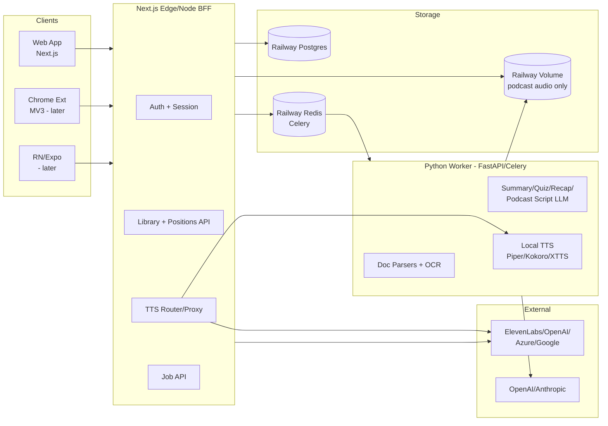
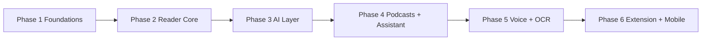

# sReadMaxxing — A Speechify-class Voice AI Reading App

A web app (with a path to iOS/Android and a Chrome extension) that maximizes reading speed & comprehension on **any** content — PDF, DOCX, Markdown, EPUB, websites, scanned images — via lifelike TTS, karaoke highlighting, speed control, AI summaries/quizzes/recaps, voice typing, an AI voice assistant, and one-click AI podcasts.

## UI/UX is the product — governs every phase

The canonical design law is [docs/UI-UX.md](docs/UI-UX.md). When code and that file disagree, the file wins. The plan below bakes its rules into the architecture and each phase rather than bolting them on. Three load-bearing consequences:

- **Design system is a first-class package, not per-app styling.** `packages/ui` holds the token system (color, type scale, spacing, motion), theme presets, and the primitives (`Player`, `KaraokeHighlighter`, `ReaderColumn`, `VoicePicker`, `StreakRing`, `Leaderboard`) reused by web, extension, and mobile. This enforces the UI-UX.md "consistency across surfaces" rule and keeps the reader bundle small (only primitives + tokens ship; heavy logic lives in `packages/core`).
- **Performance budgets are UX requirements, not nice-to-haves.** UI-UX.md §10 sets LCP < 1.0s, time-to-play < 1s, INP < 100ms, ≤150KB reader JS, CLS < 0.05. These constrain the architecture: streaming-first audio + speech marks (start playback before synthesis finishes), main-thread-free parsing (web worker / Python worker), route-split bundles, no layout shift while marks load. Phase 1 sets up the budgets; every phase must keep them green.
- **Psychology maps to features.** UI-UX.md §2's behavioral laws are referenced inline in each phase (Flow, Miller's Law, Fitts's Law, Loss Aversion, Endowed Progress, Zeigarnik, Variable Reward, Decision Fatigue, Choice Paradox) so each feature is built for the psychology it serves, not just functionally complete.

## Key decisions (reasoned)

- **Monorepo + web framework:** Next.js 15 (App Router, RSC) + TypeScript in a **Turborepo** pnpm monorepo. Next.js gives SSR/edge for fast marketing pages, API routes for BFF, and a shared TS surface that the Chrome extension (also TS/React) and React Native mobile apps can import (`@readmaxxing/core`). Turborepo keeps packages (`web`, `extension`, `mobile`, `api`, `packages/`*) building incrementally and fast.
- **API/runtime split:** Next.js handles the BFF + edge-y routes (auth, streaming, session, library CRUD, content import), but **heavy text/TTS/AI work goes to a separate service** so the web app stays light:
  - `services/worker-python` (FastAPI + Celery): document parsing, OCR, embeddings, AI summarization/quiz/podcast scripts, and **local TTS model hosting** (Piper / Kokoro / XTTS-v2 via `sherpa-onnx`/`Coqui XTTS`). GPU optional now, ready to flip on.
  - `services/api-ts` (or fold into Next.js): job orchestration + provider routing.
  - Reason: keeps the web app "fast and light"; isolates large-text processing and model loading from request handling; lets us scale the worker tier independently and run it on GPU only when needed.
- **TTS provider layer (Hybrid, per your choice):** a `TTSProvider` interface with adapters: `ElevenLabs`, `OpenAI`, `Azure`, `Google`, and `LocalModel` (sherpa-onnx/Piper) + `XTTS` for voice cloning. A router picks provider per request by voice id, latency, cost, and a free-vs-premium flag. Cloud handles quality now; local path is wired so free/offline/clone voices work without re-architecting.
- **Streaming-first audio:** TTS returns **MPEG-TS / chunked streams** with **speech marks** (timestamps per word/sentence). Marks drive karaoke highlighting and let us start playback before full synthesis finishes (low perceived latency). We persist marks alongside each generated audio chunk for resume/sync across devices.
- **Document pipeline:** upload → normalize to **Mardown + a structured segment tree** (paragraphs/sentences/words with offsets) → store. This single normalized representation powers TTS chunking, highlighting, AI summary, quiz, recap, podcast script, and search. Parsers: `pdfjs` + custom layout for PDF, `mammoth` for DOCX, native for MD/EPUB, `@mozilla/readability` + Playwright fetch for web, `tesseract`/`PaddleOCR` (Python worker) for scans/images.
- **Hosting + data — all on Railway:** web app (Next.js), Python worker, **Railway Postgres** (canonical data + auth metadata), and **Railway Redis** (Celery queue + job state) all deployed as Railway services. No Supabase, no S3/R2. One platform, one bill, private network between services.
  - **Auth: Privy** (docs.privy.io) — wallet/email/social auth, session minted as JWT; Next.js middleware validates. User row mirrored into Railway Postgres (`users`) on first login via Privy webhook.
  - **Realtime/sync: no Supabase Realtime.** Cross-device position sync via lightweight **SSE polling** from the Next.js BFF (positions table + `updatedAt`), with IndexedDB as the offline-first cache. Cheaper than WebSockets and sufficient for the low-frequency position updates.
  - **Blobs — hybrid (Option B):** the **segment tree** (text, small) + **playback positions** + all metadata live in Railway Postgres → cross-device library + resume-to-word work everywhere. **Raw uploaded files (PDFs etc.) stay local in the browser (IndexedDB)** — private, never sent to the server beyond the extracted text. **Regular TTS audio is lazy-synthesized and cached per-device in IndexedDB** (offline works, no server audio storage, TTS cost per first-play per device). **AI Podcast episodes are the exception** — they're expensive to regenerate and meant to be re-listenable, so they're **stored on a Railway persistent volume** attached to the worker and streamed via the BFF.
- **Mobile later but not blocked:** React Native (Expo) reusing `@readmaxxing/core` + `@readmaxxing/ui`. Native audio + background playback + on-device Piper model for offline TTS. Planned, not built in v1 web milestone.
- **Chrome extension later but not blocked:** MV3, shared `@readmaxxing/core` for TTS/highlight/mark logic; injects a player overlay on any page using the same provider layer via the BFF. Planned for a later phase.

## Architecture

## v1 scope = EVERYTHING (delivered in internal sub-phases)

You chose all features. Per system guidance I'm not asking for further narrowing; instead the plan sequences all features into ordered sub-phases so the milestone is achievable while still covering the full set.

### Phase 1 — Foundations

- Turborepo + pnpm workspace: `apps/web` (Next.js 15), `services/worker-python`, `packages/core`, `packages/ui`, `packages/db`, `packages/tts`, `packages/config`.
- **Design system package (`packages/ui`) — UI-UX.md §3/§9/§11.** Token system: warm-paper light (`#FBFBF8`), true-dark (`#0E0E10`), sepia, e-ink themes; 3 functional colors max (text/surface/accent); 4/8px spacing scale; modular type scale (1.250); fluid body `clamp(16px, 1.1vw + 1rem, 20px)`, 66ch measure, line-height 1.5–1.6 body / 1.1–1.2 headings; tabular figures; motion tokens (150–250ms ease-out entrances); `prefers-reduced-motion`/`prefers-color-scheme`/`prefers-contrast` hooks. Fonts: Source Serif (long-form), Inter (UI), Atkinson Hyperlegible (dyslexia option), mono for code. shadcn/ui as primitive base, themed to tokens. WCAG 2.2 AA enforced (focus rings, 44×44 targets, ARIA). Performance budgets wired into CI (LCP < 1s, INP < 100ms, reader JS ≤ 150KB gzip, CLS < 0.05).
- **Hosting/data setup:** Railway services for web + worker + Postgres + Redis + a persistent volume; **Privy** auth wired into Next.js middleware (JWT validate + user-mirror webhook into `users`); Prisma against Railway Postgres. Schema: `users`, `documents` (normalized segment tree JSONB; raw file stays client-side, not stored), `segments`, `audio_jobs`, `voices` (provider/voiceId/lang/gender/age/premium, `isMarquee` flag for celebrity defaults), `playback_positions` (docId, userId, wordOffset, speed, lastPlayedAt, updatedAt), `summaries`, `quizzes`, `notes`, `podcasts`, `podcast_episodes` (audio path on Railway volume), `usage_ledger`, plus **habit tables** (`streaks`, `xp_events`, `badges`, `user_badges`, `quests`, `leaderboard_leagues`, `daily_goals`).
- `packages/tts`: `TTSProvider` interface (`streamSynthesize`, `getVoices`, `cloneVoice`) + adapters ElevenLabs/OpenAI/Azure/Google + `LocalModel` (sherpa-onnx/Piper stub) + XTTS for cloning + a `TTSRouter`.
- Python worker scaffold: FastAPI + Celery + Railway Redis + Dockerfile (CPU now, GPU-ready).
- **Streaming audio infra:** chunked transfer + speech marks (word/sentence timestamps) returned to the client and **cached in IndexedDB** alongside the audio chunk — this is what makes time-to-play < 1s and karaoke sync possible (UI-UX.md §4.1, §4.8). No server-side audio storage for regular TTS (only podcast episodes hit the Railway volume).

### Phase 2 — Reader Core (the "maximize reading speed" engine)

- Import sources: file upload (PDF/DOCX/MD/EPUB/TXT), paste text, and **website URL** (server-side fetch via Playwright + Readability → clean article). **Uploaded files stay client-side in IndexedDB** — only the extracted text/segment tree is sent to the worker/BFF (privacy + no blob storage cost). Parsing runs off the main thread (web worker / Python worker) so the reader never janks (UI-UX.md §10).
- Python parser pipeline → normalized **segment tree** (doc → paragraphs → sentences → words with offsets) stored in Railway Postgres; raw file remains in IndexedDB.
- **Player (UI-UX.md §4 — built to the 12 rules in order):** streaming playback (time-to-play < 1s); only Play/Pause + scrubber + time always visible, everything else behind a menu (progressive disclosure — Miller/Hick); **exact-word resume** from `playback_positions` + IndexedDB + SSE sync (Zeigarnik + flow protection); **no autoplay with sound** + post-end pause with minimal status line; smooth draggable scrubber with visible duration; **0.5×–4.5× pitch-preserved speed** with presets + per-doc/per-user memory; **full keyboard map** (`Space`, `←/→` ±15s, `Shift+←/→` ±30s, `↑/↓` speed, `J/K` sentence, `R` repeat, `F` focus, `/` search, `?` shortcuts) — Fitts's Law; **karaoke word+sentence highlight** (two-level emphasis: soft sentence tint + accent word fill, 120ms advance, no strobe) driven by speech marks, click-any-word-to-jump; skip fillers + sentence/paragraph/chapter skip + repeat + sleep timer; Media Session API (background/lock-screen/media-keys); **no recommendations during playback** (decision fatigue); offline-first from IndexedDB.
- **Reader surface (UI-UX.md §5):** opt-in Bionic Reading toggle (fixation % + opacity), auto-scroll keeping current sentence in upper-third (never dead-center), focus mode (`F`) dimming non-current paragraphs, one-tap theme switch with system + time-of-day auto, reading ruler/line guide, click-to-jump text↔audio binding, selection actions ("Listen from here" / "Summarize this" / "Ask about this" / "Copy"), thin progress rail + "X% • Y min left" (endowed progress).
- **Library & onboarding (UI-UX.md §6):** zero-friction first play (~5s, paste/drop) **before** auth; one sample doc pre-loaded (endowed progress); voice picker that previews each voice on *your* text, **defaulting to a marquee/celebrity voice tile** for first-run wow (with one-tap "more voices" and the full picker later in Settings); 3-step skippable coachmark (play, speed, highlight) then vanishes. Library: calm grid/list ≤7 per chunk with "Load more" (Miller), **"Continue listening" shelf at top** (one-tap resume to exact word), AI "Last time: …" recap cards (Zeigarnik), filters-not-folders + instant `Cmd/Ctrl+K` search, aspirational empty state, bulk actions without blocking the common path.
- **Sync engine:** `playback_positions` (Railway Postgres) + IndexedDB cache + **SSE polling** from the BFF (positions keyed by `updatedAt`) → resume anywhere, cross-device "continue listening" (UI-UX.md §11 consistency rule). No Supabase Realtime.
- Offline: synthesized audio + speech marks + segment tree cached in IndexedDB; player works offline with zero network calls. Raw uploaded files also live in IndexedDB so they're available offline.

### Phase 3 — AI Layer (comprehension + retention)

- **AI features as servants, not stars (UI-UX.md §7).** All AI output **cites the source segment** (links back to exact sentence/offset) — trust > fluency.
- **Summary is layered:** 1-line TL;DR → bullets → detailed (progressive disclosure, never a wall of text).
- **Quiz = retrieval practice:** short, low-stakes, immediate feedback, no punishment for wrong answers; "test yourself" framing; celebrates streaks of correct recall. Score tracking in `quizzes`.
- **Recap on return:** short + specific ("You stopped at the section on X") — lowers re-entry cost, the biggest barrier to resuming (Zeigarnik).
- **Ask-the-doc:** conversational, grounded (never hallucinates beyond the doc); quick chips ("explain like I'm 5", "give me an example") to reduce prompt-writing effort.
- **Latency honesty (UI-UX.md §7/§11):** >2s operations show a calm status with an estimated time, not an indeterminate spinner; errors are human + actionable ("Couldn't reach the voice service — retry", not `Error 503`).
- LLM via `packages/ai` abstraction (OpenAI/Anthropic) in the Python worker; results cached in `summaries`/`quizzes`. AI work runs off the main thread to protect INP.
- **"Skip filler content":** LLM marks low-info segments skippable; player auto-skips or fast-forwards them.

### Phase 4 — AI Podcasts + Voice Assistant

- **AI Podcast generator (UI-UX.md §7):** choose style (Podcast / Late Night / Debate / Lecture) + depth → LLM turns doc/prompt into a multi-speaker script with host/guest lines → assigned to 2 voices → TTS synthesized per line + light mastering (gaps, optional music bed) → deliver as an episode with its own player + transcript + speech marks. **Episode audio is persisted on the Railway volume** (unlike regular TTS — podcasts are expensive to regenerate and meant to be re-listenable) and streamed via the BFF. **Honest staged progress** (Reading doc → Writing script → Casting voices → Producing audio) with real time estimates; variable-reward payoff at the end (no fake "2 seconds" when it takes 90).
- **Podcast feed:** discovery feed UI (≤7 per chunk, Miller's Law), **"talk with the hosts" mode** (conversational Q&A over the episode via LLM + TTS turn-by-turn). Uses the same `Player` primitive for cross-surface consistency. No recommendations during an active episode (decision fatigue).
- **Voice AI Assistant (UI-UX.md §7):** chat answering questions about the current doc/page, summarizes, explains; **answers in the user's chosen TTS voice**; keeps context of what they're listening to; supports **voice-in** (Web Speech API / Whisper) for hands-free use while walking/cooking. Grounded, source-cited answers.

### Phase 5 — Voice Typing, Voice Cloning, OCR

- **Voice Typing / dictation (UI-UX.md §7):** Web Speech API (browser) + Whisper fallback (Python worker) → transcript → LLM cleanup (grammar, filler removal) → polished text. **Shows what changed subtly (diff view)** so the user trusts it; never silently rewrites meaning. Works in an in-app editor and (later) via the extension in any input on the web.
- **Voice cloning:** record/upload a short sample → XTTS/voice-clone provider → store cloned voice id → usable across docs/podcasts. **Consent flow** is explicit and unskippable (ethical + trust).
- **Scan & Listen (OCR):** upload image/PDF-of-scans → sent to Python OCR (PaddleOCR/Tesseract, optionally cloud OCR for hard scans) → extracted text → same segment tree pipeline → TTS. The raw scan is processed ephemerally and not persisted server-side; the resulting text/segment tree syncs via Postgres. Reuses the standard `Player` + `ReaderColumn` so the experience is identical to uploaded text (consistency rule).

### Phase 5.5 — Habit & Motivation Layer (Duolingo-style, UI-UX.md §8)

Wired across phases 2–4 but called out because it's high-intensity and touches the schema (added in Phase 1 tables):

- **Streaks** with flame motif, "at risk" afternoon nudge, **streak freeze** (earnable 1/week + milestone bonuses) + **24h recovery**; streak calendar as endowed-progress anchor.
- **Push & in-app reminders** (on by default, configurable): morning cue, at-risk nudge, goal-hit celebration — framed as invites, not demands.
- **Leaderboards** (opt-out, on by default): weekly Bronze→Diamond leagues + friend leagues; one-tap private mode for users who find comparison stressful.
- **XP + daily goal ring** (user-set: minutes/words/articles); completing the goal awards XP and protects the streak; variable bonus XP for quizzes/podcasts.
- **Identity-named milestone badges** (2-Week Warrior, Century Reader, Marathon Listener, Speed Demon) with bronze/silver/gold tiers; **variable/secret rewards** on a non-fixed schedule.
- **Weekly quests/challenges** for short-term goals inside the long streak.
- **Weekly digest** (push): "4h 12m this week, up 18% — #3 in your league."
- **Shareable streaks/milestones** (one optional button, never forced) for the viral loop.
- **Pressure without shame:** break messaging is "Streak frozen — pick it back up today", never red/anxious; every loss is recoverable; progress is always real, never inflated.

### Phase 6 — Chrome Extension + Mobile

- **Chrome extension (MV3):** shared `@readmaxxing/core` + `@readmaxxing/ui` (same tokens, same `Player` primitive → UI-UX.md §11 consistency); overlay player on any page; "read this page" sends extracted text to BFF → same TTS/highlight pipeline; voice typing in any textbox; ask-questions sidebar. Reuses auth + positions for seamless handoff from web app. Respects `prefers-reduced-motion`/`prefers-color-scheme`; no mid-flow modals; UI sounds opt-in.
- **Mobile (Expo/RN):** shared `@readmaxxing/core` + `@readmaxxing/ui`; native streaming audio + background playback + lock-screen controls + CarPlay/Android Auto metadata; **on-device Piper/Kokoro** for offline TTS; camera scan → OCR; position sync via the same SSE-polling path against Railway Postgres. Touch targets ≥ 44×44, primary controls in lower thumb arc (Fitts's Law), respects OS Dynamic Type, streak/push notifications via native push (Privy / Expo push). Playback controls, voice picker, and shortcuts identical to web (Nielsen consistency).

## Tech stack summary

- **Monorepo:** Turborepo + pnpm + TypeScript
- **Web:** Next.js 15 (App Router, RSC), Tailwind + shadcn/ui (themed to `packages/ui` tokens), Zustand (player/UI state), TanStack Query (server state), IndexedDB (offline)
- **Backend BFF:** Next.js Route Handlers + Edge where useful
- **Worker:** Python, FastAPI, Celery, Redis; document parsers, OCR, LLM orchestration, local TTS
- **TTS (hybrid):** ElevenLabs / OpenAI / Azure / Google + Local (sherpa-onnx Piper, Kokoro) + XTTS for cloning; `TTSProvider` abstraction + router; streaming + speech marks
- **LLM:** OpenAI / Anthropic via abstraction (summary, quiz, recap, podcast script, assistant, dictation cleanup)
- **Hosting/data:** Railway for everything — Next.js web service, Python worker service, Railway Postgres (data + auth metadata), Railway Redis (Celery + jobs), Railway persistent volume (podcast episode audio). Prisma ORM. **Auth via Privy** (JWT in Next.js middleware; user mirrored to Postgres via Privy webhook). **Sync via SSE polling** from BFF (no Supabase Realtime). **Blobs hybrid:** segment tree + positions in Postgres; raw files + TTS audio cached in IndexedDB per device; podcast episodes on the Railway volume.
- **Mobile (later):** Expo + React Native
- **Extension (later):** Chrome MV3 (shared TS packages)
- **Infra:** Docker; deploy web + worker + Postgres + Redis + volume all on Railway (one platform, private service mesh). GPU optional on the worker when local TTS models flip on. Privy for auth. No S3/R2/Supabase.

## Key files to create first

- `docs/UI-UX.md` — already exists; canonical design law.
- `packages/ui/src/tokens.ts` — color/type/spacing/motion tokens + theme presets (Light/Dark/Sepia/E-ink) per UI-UX.md §3.
- `packages/ui/src/primitives/{Player,KaraokeHighlighter,ReaderColumn,VoicePicker,StreakRing,Leaderboard}.tsx` — shared cross-surface primitives.
- `apps/web/app/layout.tsx`, `apps/web/app/(reader)/[docId]/page.tsx` — reader shell + player
- `apps/web/components/player/Player.tsx`, `KaraokeHighlighter.tsx` — streaming + highlight (consume `packages/ui` primitives)
- `packages/tts/src/provider.ts` (interface + router), `packages/tts/src/adapters/*.ts`
- `packages/core/src/pipeline/segment-tree.ts` — normalized doc model shared by web/extension/mobile
- `services/worker-python/app/main.py`, `services/worker-python/app/tasks/{parse,ocr,ai,podcast,tts}.py`
- `packages/db/prisma/schema.prisma` — full schema above (incl. habit tables)
- `apps/web/app/api/tts/route.ts` — streaming TTS proxy + speech marks (client caches audio+marks in IndexedDB)
- `apps/web/app/api/import/route.ts` — upload + URL import → worker job (raw files stay client-side)
- `apps/web/app/api/positions/route.ts` (SSE) — cross-device position sync via Railway Postgres
- `apps/web/middleware.ts` — Privy JWT validation
- `railway.json` / `services/worker-python/Dockerfile` — Railway service + volume config

## UX acceptance gates (every phase must pass before "done")

- Reader page meets performance budgets (LCP < 1s, time-to-play < 1s, INP < 100ms, reader JS ≤ 150KB gzip, CLS < 0.05) — UI-UX.md §10.
- WCAG 2.2 AA pass (axe + manual keyboard/screen-reader sweep); AAA on the reading surface — UI-UX.md §9.
- No mid-flow interruptions; resume-to-exact-word verified on a second device — UI-UX.md §4.3/§4.11.
- Honesty checks: progress numbers real, AI answers source-cited, loading estimates honest — UI-UX.md §14.
- Habit layer never shames: break messaging is recoverable, no anxious-red styling — UI-UX.md §8.

## Notes

- Build order keeps the reading-speed value usable end-to-end by end of Phase 2; AI/Podcast/Assistant/Dictation/OCR/Habit/Extension/Mobile are layered on the same segment-tree + provider + sync + design-system primitives, so no rewrites.
- The design system (`packages/ui`) and performance budgets are established in Phase 1 so every later phase inherits UI-UX.md compliance by construction, not by retrofit.
- Out of scope for explicit v1 cost here: payments/billing, admin dashboard, team/school plans, TTS API productization — these can be added later without architectural change (usage_ledger table already provisioned for metering).

