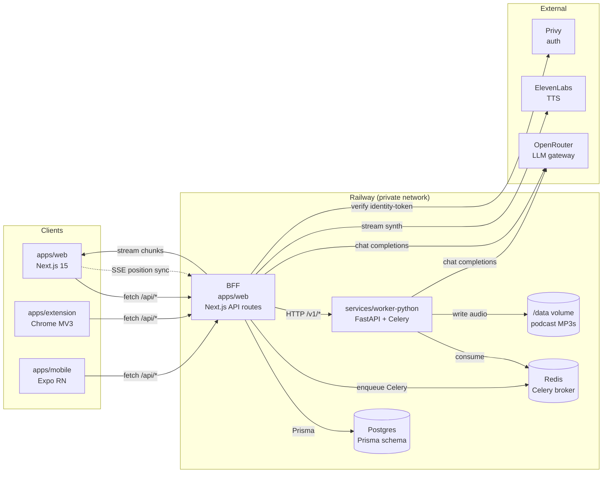
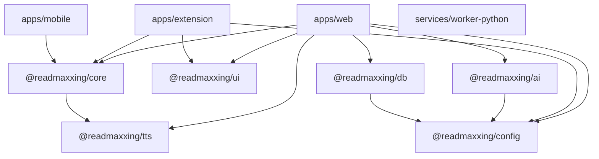
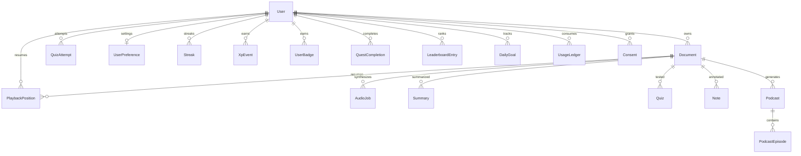
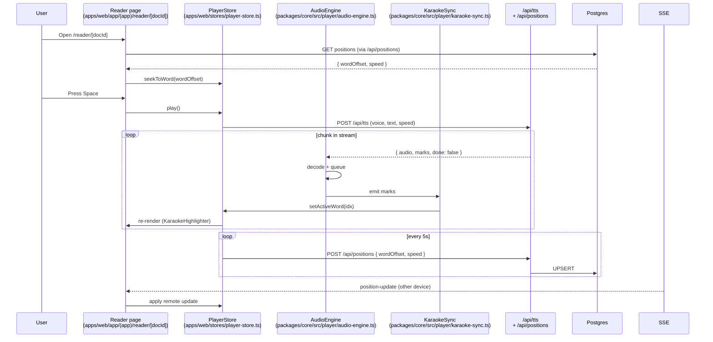
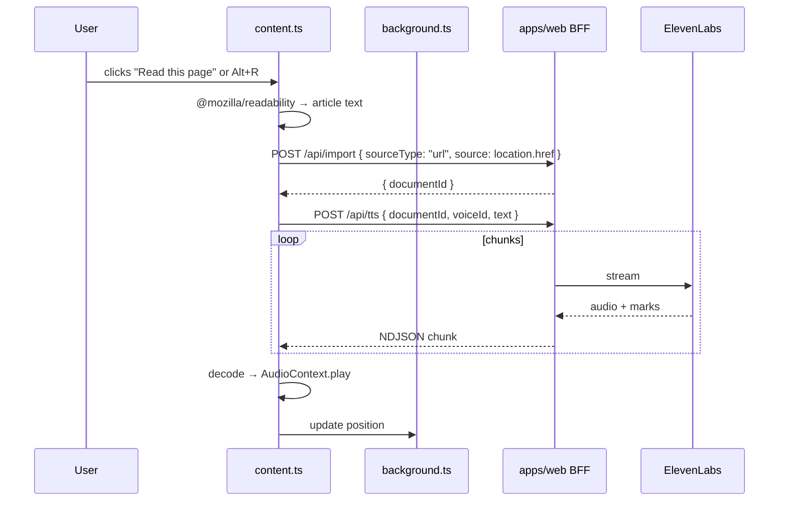
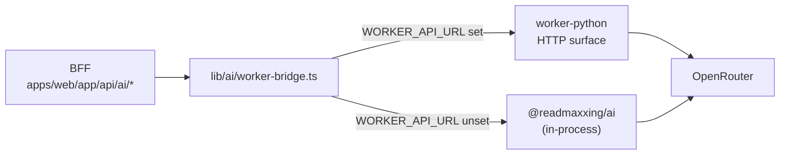
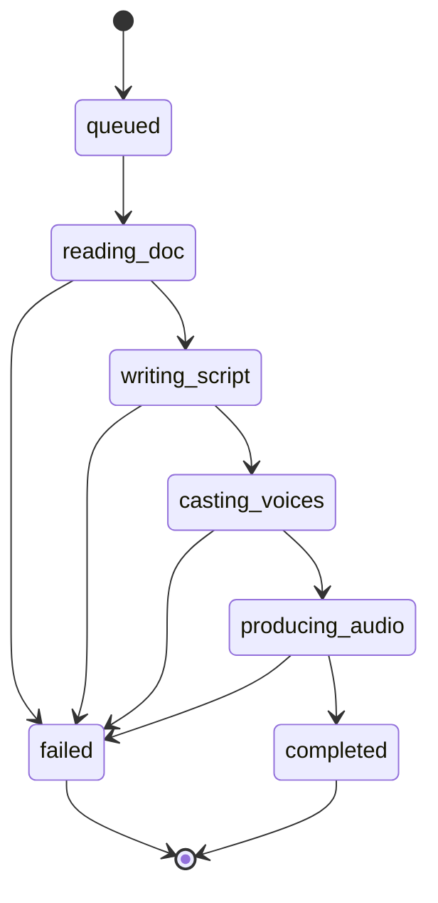

# ReadMaxxing — System Architecture

> ReadMaxxing is a Speechify-class voice AI reading app: paste text, drop a file, or
> point it at a webpage, and listen with word-accurate karaoke highlighting, resume
> exactly where you left off on any device, ask the doc questions, take a retrieval-
> practice quiz, or turn it into a multi-speaker podcast. Three platforms (web, Chrome
> extension, Expo mobile) share one document model, one TTS abstraction, one LLM
> gateway, and one Postgres-backed position store — built on Turborepo + pnpm,
> Next.js 15, FastAPI + Celery, Prisma, OpenRouter, and Railway.
>
> Quick links: [System overview](#1-system-overview) · [Monorepo layout](#2-monorepo-layout) · [Data model](#3-data-model-prisma) · [Document pipeline](#4-the-segment-tree-universal-document-model) · [TTS layer](#5-tts-layer) · [LLM layer](#6-llm-layer) · [Web app](#7-web-app-nextjs-15) · [Extension](#8-chrome-extension-mv3) · [Mobile](#9-mobile-expo--react-native) · [Python worker](#10-python-worker-fastapi--celery) · [Local dev](#11-local-development) · [Deploy to Railway](#12-deploy-to-railway) · [Critical gotchas](#13-critical-gotchas-read-this-before-changing-anything) · [Extension points](#14-extension-points) · [Testing](#15-testing--observability-briefly) · [Current state](#16-current-state-2026-06-26-morning) · [Where to start](#17-where-to-start-for-the-next-agent)

---

## 1. System overview

ReadMaxxing turns any text — paste, file, URL, OCR scan — into a synced audio reading
session with word-level karaoke, AI summary/quiz/recap/ask, multi-speaker podcasts, and
a Duolingo-style habit layer. The same primitives drive the web app, the Chrome MV3
extension ("Read this page" on any article), and the Expo/React-Native mobile app.

The three things that make this app work, and the rest of this doc:

1. **A segment tree** (`Paragraph → Sentence → Word` with character offsets) is the
   single source of truth. TTS chunking, karaoke highlighting, AI summary, quiz,
   recap, podcast script, and search all consume this one structure. See
   [`packages/core/src/types.ts`](packages/core/src/types.ts) and
   [`packages/core/src/pipeline/segment-tree.ts`](packages/core/src/pipeline/segment-tree.ts).
2. **TTS speech marks** returned alongside streamed audio let the player advance
   karaoke highlighting *before* synthesis finishes, hit a < 1s time-to-play, and
   resume to the exact word. See [`packages/tts/src/speech-mark.ts`](packages/tts/src/speech-mark.ts).
3. **Cross-device sync** via Postgres (text + positions + AI cache) + IndexedDB
   (raw files + TTS audio chunks, per-device) + SSE polling keyed by `updatedAt` —
   cheap, private-network friendly, no WebSocket fanout.



---

## 2. Monorepo layout

Turborepo + pnpm workspaces. One Node 20 runtime; one TypeScript 5.6 strict project;
one Python 3.12 service. No sub-package lockfiles; everything flows through the root
[`pnpm-lock.yaml`](pnpm-lock.yaml).

```text
ReadMaxxing/
├── apps/
│   ├── web/                Next.js 15 (App Router), BFF, all pages, all routes
│   ├── extension/          Chrome MV3 extension (Vite + @crxjs/vite-plugin)
│   └── mobile/             Expo / React-Native (SDK 51, expo-av, expo-secure-store)
├── packages/
│   ├── core/               Pure-TS SegmentTree builder, audio engine, IndexedDB cache,
│   │                       position store, karaoke sync, habit engine (streak + XP)
│   ├── ui/                 Tokens, themes, primitives, globals.css (M-Chef design law)
│   ├── tts/                TTSProvider contract, TTSRouter, SpeechMark, 5 adapters
│   ├── ai/                 OpenRouter client (fetch, no SDK), prompt helpers, parsers
│   ├── db/                 Prisma schema + generated client (@readmaxxing/db)
│   └── config/             zod-validated env (server + client) + constants
├── services/
│   └── worker-python/      FastAPI HTTP + Celery worker (parse, ocr, ai, podcast, tts)
├── docs/                   DESIGN-SYSTEM.md (law), UI-UX.md (product rules),
│                           IMPLEMENTATION-STATUS.md (phase tracker), TESTING.md (spec)
├── CHANGELOG.md            Decision log (D1–D38 + phases)
├── TESTING.md              Tests + observability spec
├── docker-compose.yml      Postgres 16-alpine + Redis 7-alpine for local dev
├── railway.toml            Web service config; worker is a separate service
├── .railway-worker.json    Worker service config (multi-process: web + Celery Beat)
├── turbo.json              Pipeline (build → lint/typecheck/test, dependsOn ^build)
└── pnpm-workspace.yaml     apps/* + packages/* + (services excluded by default)
```

### Package purposes

| Package | Purpose | Notable contents |
| --- | --- | --- |
| `@readmaxxing/core` | Pure-TS domain layer — no React, no DOM. Reused by web + extension + mobile. | `pipeline/segment-tree.ts`, `player/{audio-engine,karaoke-sync,media-session}.ts`, `sync/{idb-cache,position-store}.ts`, `habits/{streak-engine,xp-calculator}.ts`, `types.ts` |
| `@readmaxxing/ui` | The M-Chef design system — tokens, themes, primitives, globals. | `themes.ts`, `tokens.ts`, `globals.css`, `primitives/{Button,Card,Input,KaraokeHighlighter,ReaderColumn,ContinueShelf,StreakRing,…}.tsx`, `cn.ts`, `fonts.ts` |
| `@readmaxxing/tts` | TTS abstraction. Streaming `SynthesizeStream` + aligned `SpeechMark`s. | `provider.ts` (interface), `router.ts` (policy), `speech-mark.ts` (binary-search), `adapters/{elevenlabs,openai,azure,google,local}.ts` |
| `@readmaxxing/ai` | OpenRouter client + prompt helpers + parsers. No SDK, plain `fetch`. | `index.ts` (`complete`, `stream`, `completeJson`, `buildSummaryPrompt`, `buildQuizPrompt`, `buildRecapPrompt`, `buildAskPrompt`, `buildFillerPrompt`, `validateCitations`) |
| `@readmaxxing/db` | Prisma schema + generated client. Re-exports `@prisma/client`. | `prisma/schema.prisma` (24 models, 9 enums), `src/index.ts` |
| `@readmaxxing/config` | Shared zod env validation + constants (speed presets, XP values, Privy cookie). | `src/env.ts`, `src/constants.ts` |

### Shared-dependency graph



Note: `services/worker-python` is *not* a TS workspace — it has its own
`pyproject.toml` / `requirements.txt` and is excluded from `pnpm install` by
default. It mirrors `packages/core/src/pipeline/segment-tree.ts` in pure Python
([`services/worker-python/app/tasks/parse.py`](services/worker-python/app/tasks/parse.py))
and mirrors `packages/ai/src/index.ts` in pure Python
([`services/worker-python/app/tasks/openrouter.py`](services/worker-python/app/tasks/openrouter.py))
so the same input produces the same output from either runtime.

### Why Turborepo + pnpm

- **Turborepo** for cached `^build` task graphs (`turbo.json` pins `build → lint/typecheck/test`),
  parallel `dev`, and `outputs` so CI never re-builds unchanged packages.
- **pnpm workspaces** for hard-link dedup of `node_modules` (matters with Prisma + Next
  + Chromium), strict peer-dep resolution, and an `apps/mobile` filter that can be
  skipped on machines that don't have the Expo dev client.
- The `pnpm-workspace.yaml` declares `apps/*` and `packages/*`; the Python service
  lives outside the workspace and is set up with its own venv.

---

## 3. Data model (Prisma)

The single source of truth for every server-side concern is
[`packages/db/prisma/schema.prisma`](packages/db/prisma/schema.prisma). 24 tables + 9 enums.
Local dev applies it with `pnpm --filter @readmaxxing/db db push` (Phase 1 schema
synced via `prisma db push`; production should use `prisma migrate dev` to generate
a real migration before the first Railway deploy).

### The 24 tables

| Group | Tables |
| --- | --- |
| **Identity + meta** | `User` (Privy-mirrored, PK = `did:privy:…`), `UserPreference` (typed envelope in `prefs` JSON), `Consent` (versioned — D25 forces re-consent on wording change). |
| **Documents** | `Document` (full `segmentTree` JSONB, wordCount, read-time, `fillerSegments: Int[]`), `AudioJob` (TTS queue with cost cents), `Voice` (catalog row, `isMarquee` + `isCloned`/`ownerId` flags), `Note` (anchored highlight). |
| **Playback** | `PlaybackPosition` (`(userId, documentId)` PK, `wordOffset` + `speed` + `updatedAt` — drives SSE polling). |
| **AI cache** | `Summary` (layered `{tldr, bullets, detailed}` + citations), `Quiz` + `QuizAttempt`, `RecapCache` (keyed by `anchorWordOffset`). |
| **Podcasts** | `Podcast` (series) + `PodcastEpisode` (script + `audioPath` on Railway volume + `status` enum + `progress` JSON). |
| **Habit layer** | `Streak` (one per user: `currentDays`, `longestDays`, `freezesAvailable`, `calendar` JSON), `XpEvent` (append-only ledger with `XpSource`), `Badge` + `UserBadge` (canonical catalog + awards with `tierAtAward`), `Quest` + `QuestCompletion`, `LeaderboardLeague` + `LeaderboardEntry`, `DailyGoal` (`minutes` / `words` / `articles`, per `dateKey`). |
| **Metering** | `UsageLedger` (TTS chars, LLM tokens in/out, OCR pages, voice-clone minutes + `costCents`). |

### Key relationships



### Important enums

- `DocumentSourceType` — `pdf | docx | md | epub | txt | url | paste` — drives the worker parser path.
- `AudioJobStatus` — `queued | in_progress | completed | failed | cancelled`.
- `PodcastEpisodeStatus` — `queued | reading_doc | writing_script | casting_voices | producing_audio | completed | failed` (same strings the SSE stream emits).
- `XpSource` — `reading | listening | quiz | podcast | voice_typing | ocr | share | streak_bonus | daily_goal_bonus | milestone_bonus` (every `XPAction` maps to exactly one).
- `BadgeTier` — `bronze | silver | gold`. `PodcastStyle` — `podcast | late_night | debate | lecture` (the 4-style picker).

### The "user-mirror" pattern (Privy → Postgres)

We don't store passwords. Auth lives in Privy (wallet / email / social). The flow:

1. Privy issues an identity token to the browser. `apps/web/middleware.ts` resolves
   the user id from `x-dev-user-id` / `rmx-dev-user` cookie today (Phase 1 stub); the
   real swap-in is `PrivyClient.utils().auth().verifyAccessToken` from `@privy-io/node`
   at `apps/web/lib/privy-verify.ts`.
2. Privy fires `user.created` / `user.updated` / `user.linked_account` to
   `POST /api/auth/webhook` (signed; HMAC-verified). The handler upserts a `User` row
   with `id = did:privy:…` so all foreign keys are stable Privy ids.
3. Every BFF route that touches a per-user table reads `x-user-id` (set by the
   middleware), looks up `User`, and 401s on miss. Public routes are listed in
   `PUBLIC_API_PREFIXES` (`/api/health`, `/api/auth/webhook`, `/api/voices`).

### Privacy — which fields are sensitive

| Field | Sensitive? | Why | Where it lives |
| --- | --- | --- | --- |
| Audio bytes (TTS chunks) | Yes — never persist server-side | Per-device only; cheap to regenerate; size grows fast | IndexedDB (`audio-chunks` store in `packages/core/src/sync/idb-cache.ts`) |
| Voice-clone samples | Yes — biometric | User-supplied audio, never leaves the user's session except to the worker. | Uploaded via `POST /api/voice/clone`, persisted to `Consent` (audit) + a `Voice` row with `isCloned: true, ownerId`. |
| OCR raw images | Yes — may contain PII | Scanned documents can include personal data | Sent to worker, returned as text + per-page confidence; image bytes are not persisted. |
| Document text | No (user's own content) | Lives in `Document.segmentTree` JSONB so it syncs cross-device | Postgres `Document` |
| Podcast MP3 audio | Server-side (exception) | Expensive to regenerate, meant to be re-listened to | Railway volume at `PODCAST_VOLUME_PATH=/data` (default `/data/podcasts`). Path stored in `PodcastEpisode.audioPath`. |
| User prompts to AI | Aggregated only | We log `line_count`, `speaker_count`, `bytes`, `duration_ms`, stage names — never transcript text (D23, TESTING.md §8.7). | Structured JSON to stdout |

---

## 4. The segment tree (universal document model)

The linchpin of the entire system. Lives in
[`packages/core/src/types.ts`](packages/core/src/types.ts) as plain TS types, with the
builder in
[`packages/core/src/pipeline/segment-tree.ts`](packages/core/src/pipeline/segment-tree.ts)
and the Python mirror in
[`services/worker-python/app/tasks/parse.py`](services/worker-python/app/tasks/parse.py).
Parity tests in [`services/worker-python/tests/test_segment_tree_parity.py`](services/worker-python/tests/test_segment_tree_parity.py).

```typescript
// packages/core/src/types.ts
export interface Word {
  text: string;
  start: number;        // inclusive char offset into original text
  end: number;          // exclusive
  index: number;        // sequential within parent sentence
}

export interface Sentence {
  text: string;
  start: number;
  end: number;
  index: number;
  words: Word[];
}

export interface Paragraph {
  text: string;
  start: number;
  end: number;
  index: number;
  headingLevel: 0 | 1 | 2 | 3 | 4 | 5 | 6;
  sentences: Sentence[];
}

export interface SegmentTree {
  segmentTreeId: string;     // stable SHA-1 of normalized text — dedupes uploads
  documentId: string;
  title: string | null;
  author: string | null;
  language: string;
  text: string;              // canonical normalized source
  paragraphs: Paragraph[];
  createdAt: string;
  wordCount: number;
  estimatedReadTimeSeconds: number;   // wordCount / WORDS_PER_MINUTE (155)
}
```

### Why this is the linchpin

Every feature that needs to reference "a specific part of the document" does so with
`(paragraphIndex, sentenceIndex, wordIndex)` triplets that map directly to the tree:

| Consumer | What it does with the tree |
| --- | --- |
| TTS chunking | Splits `paragraphs[].sentences[].words[]` into chunks small enough to fit in a TTS request. Reassembles on the way back. |
| Karaoke highlighter | Maps `(timeSeconds → SpeechMark → word.index)` so the active word paints. Data-attributes `data-word-idx`, `data-current-word`, `data-current-sentence` are the DOM contract. |
| AI summary | Cites with `[cite:paragraphIndex:sentenceIndex]` — the citation rule `CITE_RE` in `packages/ai/src/index.ts`. |
| Quiz | Pulls the right `paragraphIndex` from a citation tag, links the explanation back to a paragraph. |
| Recap | "Stopped at paragraph N, sentence M" — same anchor shape as positions. |
| Podcast script | Walks the tree to compute per-paragraph read-time, picks speakers, writes lines anchored to source paragraphs. |
| Search / Click-to-jump | `locateWord(text, offset)` returns the matching `Word` for resume-from-offset. |

### How the parser builds it

Pure rule-based, no ML. Mirrors between TS and Python.

1. **Normalize input** — strip BOM, CRLF → LF, optional leading `Title:` / `Author:` lines.
2. **Split paragraphs** — on `\n\n` boundaries; markdown heading lines (`#…######`) tag `headingLevel` so chapter-skip works. List bullets (`-`, `*`, `1.`) and blockquotes (`>`) are reduced to plain text without losing their offsets.
3. **Split sentences** — terminals `[.!?]` plus optional closing quotes/parens; abbreviations (`mr`, `mrs`, `dr`, `prof`, `sr`, `jr`, `st`, `vs`, `etc`, `e.g`, `i.e`, `no`, `inc`, `ltd`, `co`) do NOT split. Quoted dialogue inside `"…"` / `'…'` is split on its own internal `!` or `?`.
4. **Tokenize words** — whitespace + punctuation aware, contractions (`don't`, `it's`) stay single words. Offsets point into the *original* text so re-attaching highlight is byte-correct.
5. **Compute SHA-1** of normalized text → `segmentTreeId`. Identical uploads dedupe to the same `Document` row in Postgres.

The TS builder is pure-TS; the Python builder lives in
`services/worker-python/app/tasks/parse.py` with the same abbreviation list and the
same word regex — that's what `test_segment_tree_parity.py` pins (2 pre-existing
failures noted in `IMPLEMENTATION-STATUS.md`).

---

## 5. TTS layer

Streaming-first audio. Every TTS request returns a `SynthesizeStream` that yields
`{audio, speechMarks, done, chunkIndex}` frames so the player starts playback from
the first chunk and karaoke highlighting advances *before* full synthesis finishes
(UI-UX.md §4.1 — time-to-play < 1s).

### The `TTSProvider` interface — [`packages/tts/src/provider.ts`](packages/tts/src/provider.ts)

```typescript
export interface TTSProvider {
  readonly id: TtsProviderId;  // "elevenlabs" | "openai" | "azure" | "google" | "local" | "xtts"
  getVoices(): Promise<Voice[]>;
  streamSynthesize(opts: SynthesizeOptions): SynthesizeStream;   // async-iter of SynthesizeChunk
  cloneVoice?(opts: CloneVoiceOptions): Promise<Voice>;
}

export interface SynthesizeChunk {
  audio: Uint8Array;          // raw MP3/MPEG-TS/Opus — never base64 in-memory
  speechMarks: SpeechMark[];  // aligned to this chunk
  done: boolean; chunkIndex: number;
}
```

### Adapters (5, in [`packages/tts/src/adapters/`](packages/tts/src/adapters/))

| Adapter | Status | Speech marks |
| --- | --- | --- |
| `elevenlabs.ts` | **Real** — `/v1/text-to-speech/{voice_id}/stream/with-timestamps` (default model `eleven_flash_v2_5`, seeds include `eleven_rachel`). Throws clear error if `ELEVENLABS_API_KEY` unset. | Native char-level timing |
| `openai.ts` | **Stub** (Whisper force-align deferred). Static voices (`alloy`, `echo`, `nova`, `shimmer`). | None native |
| `azure.ts` / `google.ts` | **Stubs**. | Native word-boundary events (when wired) |
| `local.ts` | **Stub** (sherpa-onnx). | Estimated via `_tokenize.ts` heuristic |

All five ship typed even when only ElevenLabs is real — the router + UI surfaces
never assume which provider serves a voice, so adding a new provider is a
typed-stub change that doesn't ripple through the BFF or player (see §14).

### `TTSRouter` — voice → provider lookup

[`packages/tts/src/router.ts`](packages/tts/src/router.ts). Selection precedence:

1. Explicit `voiceId → provider` (highest priority — `Voice.id` is composite `provider:voiceId`).
2. `Voice.isMarquee` → use that provider.
3. `policy.premium === false` → cheapest cloud + local fallback; premium voices throw "requires premium".
4. `policy.premium === true` → highest quality cloud provider.
5. `policy.latencyBudgetMs` → skip providers whose p95 exceeds the budget.

### Speech-mark normalization

[`packages/tts/src/speech-mark.ts`](packages/tts/src/speech-mark.ts) defines one shape every adapter must produce. `findWordAtTime(marks, timeSeconds)` is a binary search over word marks used by `karaoke-sync.ts` to paint the active word (drift-aware — emits a `drift_ms` report). Defensive fallback when marks are missing or incomplete: `heuristicSpeechMarks()` in `packages/tts/src/speech-marks.ts`.

### Why TTS audio is per-device IndexedDB (not server-side)

TTS chunks are cheap to regenerate and > 1 MB per minute of audio; storing them
server-side would multiply storage cost by `users × docs × voice-replays` for zero
benefit. IndexedDB is already on-device, supports binary blobs, and the
offline-first path (UI-UX.md §4.12) needs it anyway. The single exception is **AI
podcast episodes** — expensive to regenerate, meant to be re-listened to — which
persist to the Railway volume at `PODCAST_VOLUME_PATH=/data`.

---

## 6. LLM layer

OpenRouter is the **only** LLM gateway. One API key, any model, automatic provider
fallback. No `openai` or `anthropic` SDK is installed anywhere; both clients speak to
`https://openrouter.ai/api/v1/chat/completions` via plain `fetch` / `httpx`.

### TS client — `packages/ai/src/index.ts`

Three public functions + five prompt helpers + two response parsers:

```typescript
complete(req: AiCompletionRequest): Promise<AiCompletionResponse>
stream(req: AiCompletionRequest): AsyncIterable<string>          // NDJSON-style SSE
completeJson<T>(req: AiCompletionRequest): Promise<{parsed, text, usage}>

buildSummaryPrompt({ documentText, style? })                     // TL;DR / bullets / detailed
buildQuizPrompt({ documentText, questionCount? })                 // strict JSON schema
buildRecapPrompt({ documentText, lastParagraphIndex, lastSentenceIndex })
buildAskPrompt({ documentText, question, systemOverride? })       // grounded Q&A
buildFillerPrompt({ documentText })                               // strict JSON schema

parseSummary(text): ParsedSummary                                  // {tldr, bullets, detailed, citations}
parseFillerResult(parsed): ParsedFiller[]
parseQuiz(parsed): ParsedQuiz
validateCitations(text): CitationValidation                        // {ok, count, anchors, proseLength, missing}
countCitations(text): number
```

Every prompt helper appends the `CITE_RULE` block:

> Every factual claim must cite the source segment using a citation tag of the form
> `[cite:paragraphIndex:sentenceIndex]` (zero-indexed). If a claim is not supported by
> the source, omit it. Never invent citations. Output MUST contain at least one
> `[cite:p:s]` tag per non-trivial claim — trust > fluency (UI-UX.md §7).

`validateCitations` enforces this at parse time: if the response is > 40 chars of prose
without any `[cite:p:s]`, it returns `ok: false, missing: true` and the BFF logs an
`ai.citation_missing` event (D12). The reader renders citation tags as jump-to-paragraph
buttons.

### App metadata headers

The TS client sends `HTTP-Referer`, `X-Title`, and a custom `X-Readmaxxing-Feature`
header (e.g. `"summary"`, `"quiz"`, `"podcast"`) so the OpenRouter dashboard can
attribute cost to features. The Python client does the same. Defaults:

```typescript
const OPENROUTER_BASE = "https://openrouter.ai/api/v1";
const DEFAULT_MODEL   = "openai/gpt-4o-mini";   // override per call
```

### Python mirror — `services/worker-python/app/tasks/openrouter.py`

Identical surface. Uses `httpx` instead of `fetch`. Functions: `complete()`, `acomplete()`,
`astream()`, `summary_messages`, `quiz_messages`, `recap_messages`, `ask_messages`,
`filler_messages`, `podcast_script_messages`. Same citation rule. Same default model
(read from `OPENROUTER_DEFAULT_MODEL`, fallback `"openai/gpt-4o-mini"`).

### Where LLM usage is metered

Every AI route writes a `UsageLedger` row on success:

```python
UsageLedger(
  userId, metric="ai_summary" | "ai_quiz" | "ai_ask" | "ai_recap" | "filler_detect",
  amount=inputTokens + outputTokens, provider="openrouter", costCents=0,
  sourceId=documentId,
)
```

Billing UI is deferred (D16); the rows are ready for Phase 5/6 quota meters.

---

## 7. Web app (Next.js 15)

`apps/web` is the Next.js 15 App Router application. It runs the BFF (every `route.ts`
under `app/api/*`), the player + reader pages, the library + onboarding, and the AI
surfaces (summary, quiz, recap, ask, podcast, assistant, dictation).

### Route map

```text
app/
├── layout.tsx                    # SSR theme cookie → [data-theme] + CSS vars
├── providers.tsx                 # PrivyProvider, QueryClientProvider, ToastRegion
├── page.tsx                      # → redirect to /library
├── globals.css                   # imports @readmaxxing/ui/globals.css
├── (app)/                        # Authed application routes
│   ├── library/page.tsx          # Calm grid + Continue shelf + ImportDropzone
│   ├── reader/[docId]/page.tsx   # KaraokeHighlighter + ReaderColumn + PlayerBar
│   ├── assistant/page.tsx        # Full-screen voice assistant (Web Speech API)
│   ├── dictation/page.tsx        # Voice-typing with word-level diff cleanup
│   ├── podcasts/page.tsx         # Calm feed (≤ 7/chunk) + style filters + creator
│   ├── podcasts/[episodeId]/page.tsx  # Player + transcript + "Talk with the hosts"
│   ├── settings/page.tsx         # Preferences envelope (PUT /api/user/preferences)
│   └── voice/page.tsx            # VoiceCloneFlow + VoicePicker
└── api/
    ├── auth/webhook/route.ts     # Privy HMAC-verified user mirror
    ├── health/route.ts           # Railway health probe (liveness)
    ├── health/deep/route.ts      # Postgres + Redis + worker probe (readiness)
    ├── documents/{route.ts,[id]/route.ts}    # list / single / positions
    ├── import/{route.ts,ocr/route.ts}        # text/URL/file → Document ; OCR scan-and-listen
    ├── tts/route.ts              # NDJSON streaming TTS proxy
    ├── positions/{route.ts,stream/route.ts}  # POST update ; SSE polling by updatedAt
    ├── voice/clone/route.ts      # Multipart upload + consent gate
    ├── user/preferences/route.ts # GET/PUT envelope (shallow merge)
    ├── ai/
    │   ├── summary|quiz|recap|fillers|ask|dictation/cleanup|assistant/route.ts
    │   └── podcasts/{route.ts,[id]/{route,progress,stream,transcript,chat}/route.ts}
    └── habits/{streak,xp,leaderboard,quests,badges}/route.ts
```

### Layout structure

The `(app)`, `(reader)`, and `(marketing)` groups are App Router organizational groups,
not URL prefixes. All render the same root
[`apps/web/app/layout.tsx`](apps/web/app/layout.tsx):

```typescript
import { Inter } from "next/font/google";
import { themeCssVars, themes, initialThemeFromCookie } from "@readmaxxing/ui";

const inter = Inter({ subsets: ["latin"], display: "swap", variable: "--font-sans-loaded" });

export default async function RootLayout({ children }) {
  const themeCookie = (await cookies()).get("theme")?.value;
  const themeName  = initialThemeFromCookie(themeCookie);   // server-safe!
  const themeVars  = themeCssVars(themes[themeName]);
  return (
    <html lang="en" data-theme={themeName} style={themeVars} className={inter.variable} suppressHydrationWarning>
      <body className="min-h-dvh bg-canvas text-ink antialiased">
        <Providers>{children}</Providers>
      </body>
    </html>
  );
}
```

### Privy auth flow

```mermaid
flowchart LR
  Browser -- identity-token --> Middleware[apps/web/middleware.ts]
  Middleware -- x-user-id --> Routes[BFF route handlers]
  Privy[Privy] -- webhook POST --> Webhook[/api/auth/webhook]
  Webhook -- upsert --> User[(User)]
  Routes -- lookup --> User
```

1. Privy issues the identity-token to the browser.
2. `apps/web/middleware.ts` resolves the user id (today via the dev cookie / header;
   in production via `verifyAccessToken` from `@privy-io/node`).
3. The middleware sets `x-user-id` and forwards to the route handler.
4. The handler reads `request.headers.get("x-user-id")`, looks up the `User` row,
   401s on miss, 502s on a worker failure with a human message.
5. `POST /api/auth/webhook` is the only `/api/*` route *public* from middleware —
   Privy calls it without a session, signed by HMAC; the handler upserts the `User` row.

### Streaming audio — NDJSON from `/api/tts`

[`apps/web/app/api/tts/route.ts`](apps/web/app/api/tts/route.ts) returns
`Transfer-Encoding: chunked` + `Content-Type: application/x-ndjson` with one JSON
object per line:

```typescript
{ audio: "<base64 mp3 bytes>", marks: SpeechMark[], done: false, chunkIndex: 0 }
// ...
{ audio: "<base64 mp3 bytes>", marks: [],                done: true,  chunkIndex: N }
```

The client feeds the stream to `AudioEngine.consumeStream()` from
`@readmaxxing/core`, which buffers, decodes, and queues chunks; karaoke sync maps
the first chunk's `marks` to the active word index. The reader page's RAF loop
re-syncs to speech marks within ~120ms so any drift between estimated vs actual
timing is inaudible.

### SSE position sync

`apps/web/app/api/positions/stream/route.ts` is a Server-Sent Events endpoint that
polls `PlaybackPosition.updatedAt` and emits `event: position-update` frames for
positions newer than the `?since=` query param (30s heartbeat, 200 OK, 5s
retry-after on drop). Client side: `packages/core/src/sync/position-store.ts` keeps
the local store; the web app uses a thin `EventSource` wrapper. Writes are
debounced 1–2s and batched into one POST.

### Theme provider — server-safe `initialThemeFromCookie`

The theme is resolved **server-side** so SSR HTML already has the right
`[data-theme]` attribute and inline CSS variables — no flash of wrong theme on
first paint. `initialThemeFromCookie` lives in
[`packages/ui/src/themes.ts`](packages/ui/src/themes.ts) (not `providers.tsx`,
which is client-only). The layout calls
`initialThemeFromCookie(cookies().get("theme")?.value)` and `themeCssVars(themes[themeName])`
and injects them as inline style on `<html>`. The client `Providers` then takes
over for runtime theme switches.

### Tailwind v3 — clarify

The pinned `tailwindcss` dep in `apps/web/package.json` is **3.4.x**, not v4. We
considered v4-beta for `@import "@readmaxxing/ui/globals.css"` (Phase 1 plan §D7)
but did not adopt it — the v3 setup with a shared `packages/ui/tailwind.config.ts`
and a PostCSS step in `apps/web/postcss.config.mjs` is the canonical pipeline.

### The static-assets-in-standalone quirk

`apps/web/next.config.ts` sets `output: "standalone"`. Standalone omits
`.next/static/` (JS chunks, CSS, fonts) and `.next/server/` (server-side chunks for
dynamic routes). The deploy script must populate them — see §13 for the canonical
copy commands.

### Player + karaoke data flow



---

## 8. Chrome extension (MV3)

[`apps/extension/`](apps/extension/) is a full Chrome MV3 extension built with
**Vite 5 + `@crxjs/vite-plugin`** that reuses the same `@readmaxxing/core` segment
tree, `@readmaxxing/ui` design tokens, and BFF endpoints as the web app. Total bundle
~107 KB gzip (well under Chrome's 500 KB MV3 budget).

### Manifest structure

```json
// apps/extension/manifest.json (excerpt)
{
  "manifest_version": 3,
  "permissions": ["activeTab", "scripting", "storage", "identity"],
  "host_permissions": ["<all_urls>"],
  "action": { "default_popup": "popup.html" },
  "background": { "service_worker": "background.ts" },
  "commands": { "toggle-reader": { "suggested_key": { "default": "Alt+R" } } }
}
```

`activeTab` (not `<all_urls>` injection on passive loads — D33/TESTING.md §2.15.3).
The content script only runs on explicit user gesture: popup click or `Alt+R`.

### Component split

- **`src/content.ts`** — runs in the page's isolated world; extracts the article via
  `@mozilla/readability`, posts the article text to `POST /api/import`, mounts the
  `OverlayPlayer` into a shadow DOM host so the page's CSS can't leak.
- **`src/background.ts`** — service worker; relays messages between popup ↔ content
  script; wires the `Alt+R` command.
- **`src/popup.tsx` + `src/App.tsx`** — React entry; `HashRouter` with routes
  `/library`, `/reader/:docId`, `/settings`, `/voice-clone`.
- **`src/components/OverlayPlayer.tsx`** — floating React tree injected into the active
  tab. Reuses `MediaSessionWrapper` from `@readmaxxing/core` for OS media-key +
  lock-screen control.
- **`src/components/library/PopupLibrary.tsx`** — reuses `<ContinueShelf>` from
  `@readmaxxing/ui` + a "Read this page" button.
- **`src/lib/auth.ts`** + **`src/lib/messages.ts`** — `chrome.storage`-backed token
  cache + typed message envelope.

### The "Read this page" flow



### Shared package reuse

```typescript
// apps/extension/vite.config.ts (excerpt)
resolve: {
  alias: {
    "@readmaxxing/core": path.resolve(__dirname, "../../packages/core/src"),
    "@readmaxxing/ui":   path.resolve(__dirname, "../../packages/ui/src"),
    "@readmaxxing/tts":  path.resolve(__dirname, "../../packages/tts/src"),
  },
}
```

Per-chunk code-splitting keeps the bundle small. Tests: `lib/auth.test.ts` (3),
`lib/messages.test.ts` (4), and `test/popup.spec.ts` (3 Playwright e2e — requires
Chromium with `--load-extension` support).

---

## 9. Mobile (Expo + React Native)

[`apps/mobile/`](apps/mobile/) is an Expo SDK 51 app with the same segment-tree
primitives as the web app, but RN-native ports of the Tailwind-based UI components
(Tailwind classes don't apply in RN — D32). Background audio + lock-screen + native
push are wired.

### Status (Phase 6)

Scaffolded end-to-end with Phase 6.1 follow-up (`react-native-sherpa-onnx` for
on-device TTS) awaiting `pnpm install` (Expo + react-native native deps are heavy —
the `typecheck` / `test` scripts print a "run `pnpm install` first" message until
then) + `prebuild` (generates the `ios/` + `android/` native directories).

### Layout

```text
apps/mobile/
├── app.json                   # UIBackgroundModes: ["audio"], MODIFY_AUDIO_SETTINGS
├── app/
│   ├── _layout.tsx            # ThemeProvider + PrivyProvider + Stack
│   ├── (tabs)/{_layout,index,podcasts,assistant,settings}.tsx  # bottom tabs
│   └── doc/[docId].tsx        # reader screen, reuses @readmaxxing/core segment tree
├── components/                # RN-native ports (no Tailwind — D32)
│   ├── MobileCard.tsx         # 20px radius, accent strip
│   ├── MobileVoicePicker.tsx  # 10px radius, sorts cloned voices to top
│   ├── MobilePlayer.tsx, PrivyProvider.tsx, ThemeProvider.tsx
└── lib/auth.ts                # expo-secure-store token cache
```

### Streaming + background playback

`expo-av` `Audio.Sound` for streaming + `UIBackgroundModes: ["audio"]` on iOS +
`MODIFY_AUDIO_SETTINGS` on Android (foreground audio service) keeps the session
alive when the screen locks or the user switches apps (UI-UX.md §4.10). The reader
screen wires the same data-attribute contract (`data-word-idx`,
`data-current-word`, `data-current-sentence`) so cross-surface tests pass.

### Phase 6.1 follow-up — on-device TTS

Replace `expo-av`'s streaming path with `react-native-sherpa-onnx` for Piper/Kokoro
local TTS. Needs a custom Expo dev client (the C++ build isn't in the Expo Go
sandbox). The reader screen has a swap-in comment.

### Native push

`expo-notifications` for both APNs (iOS) and FCM (Android). Push notification certs
are owned by the user — APNs key + FCM service account must be configured before
the first push (see §12).

---

## 10. Python worker (FastAPI + Celery)

[`services/worker-python/`](services/worker-python/) is the only Python in the
repo. FastAPI serves the HTTP surface; Celery consumes Redis queues. The BFF
prefers the HTTP surface when `WORKER_API_URL` is set, falling back to in-process
`@readmaxxing/ai` (D13) so a single worker outage doesn't break the reader.

### Layout

```text
services/worker-python/
├── app/
│   ├── main.py                # FastAPI HTTP (all /v1/* + /health + /ready)
│   ├── celery_app.py          # Celery app + queues + Beat schedule
│   ├── config.py              # Pydantic Settings (env-driven)
│   └── tasks/
│       ├── openrouter.py      # Shared httpx client + prompt helpers
│       ├── parse.py           # SegmentTree builder (Python mirror of packages/core)
│       ├── ocr.py             # vision-LLM OCR via OpenRouter + confidence
│       ├── ai.py              # summary / quiz / recap / ask / fillers
│       ├── podcast.py         # generate_podcast (Celery task + sync orchestrator)
│       ├── tts.py             # sherpa-onnx stub + clone_voice Celery task
│       └── leaderboard_cron.py # weekly promotion (pure functions + orchestrator)
├── tests/                     # segment-tree parity, OCR conf, tts clone, podcast pipeline, leaderboard cron
├── pyproject.toml, requirements.txt (Nixpacks), Dockerfile (3.12-slim, non-root)
└── railway.toml               # in-service override
```

### HTTP routes

| Method | Path | Purpose |
| --- | --- | --- |
| GET | `/health`, `/ready` | Liveness (no external deps) + readiness (Redis + Celery ping). |
| POST | `/v1/parse` | Sync parsing (currently 501; production path is the Celery task). |
| POST | `/v1/ocr` | Vision-LLM OCR for image scans (via OpenRouter). Returns text + model-reported confidence + `low_confidence` flag. |
| POST | `/v1/ai/{summary,quiz,recap,fillers}` | Layered summary / quiz (strict JSON) / recap / fillers. |
| POST | `/v1/ai/ask`, `/v1/ai/run` | Grounded Q&A; generic chat-completion passthrough (BFF uses when `WORKER_API_URL` set). |
| POST | `/v1/podcast/run` | Sync orchestrator — script → TTS → master → volume. Returns manifest. |
| GET | `/v1/podcast/{id}/progress` | SSE stream of `podcast.stage` events (replay-on-attach, 5s heartbeat, terminal-state short-circuit). |
| GET | `/v1/podcast/{id}/audio` | Bytes-range MP3 stream (resolved via `Path(PODCAST_VOLUME_PATH).rglob(f"{episode_id}.mp3")`). |
| POST | `/v1/tts/stream`, `/v1/tts/clone` | Stream TTS synthesis; voice clone (XTTS-v2 stub — validates size, returns `cloned:<uuid>`). |

### Celery queues + tasks

```python
# services/worker-python/app/celery_app.py
celery_app = Celery(
  "readmaxxing",
  broker=settings.redis_url,
  backend=settings.redis_url,
)
celery_app.conf.task_routes = {
  "app.tasks.parse.*":    {"queue": "parse"},
  "app.tasks.ocr.*":      {"queue": "ocr"},
  "app.tasks.ai.*":       {"queue": "ai"},
  "app.tasks.podcast.*":  {"queue": "podcast"},
  "app.tasks.tts.*":      {"queue": "tts"},
}
# Celery Beat: weekly leaderboard promotion
celery_app.conf.beat_schedule = {
  "leaderboard-weekly-promotion": {
    "task": "app.tasks.leaderboard_cron.run_weekly_promotion",
    "schedule": crontab(hour=0, minute=0, day_of_week="mon"),
  },
}
```

### The worker-bridge pattern



If `WORKER_API_URL` is set, the BFF forwards to the worker. If not, it runs
in-process via `@readmaxxing/ai` — same prompts, same model, same output (D13).
For the **ask** route, streaming happens in-process unconditionally; the worker
bridge doesn't add SSE forwarding.

### `PodcastEpisode` status flow



Every transition emits a `podcast.stage` event via the in-memory `StageEvent`
tracker (with `duration_ms` and `progress_pct`). The BFF's SSE handler
replays the history on connect so late subscribers see the full timeline, then
streams live updates.

### Episode audio on the Railway volume

The worker writes the mastered MP3 to
`PODCAST_VOLUME_PATH/<document_id>/<episode_id>.mp3` and returns the relative path
in the manifest; the BFF persists it to `PodcastEpisode.audioPath`. On every
request, `/v1/podcast/{id}/audio` resolves the file via `volume_root.rglob(f"{episode_id}.mp3")`
and streams with bytes-range support.

### Celery task signature (excerpt)

```python
# services/worker-python/app/tasks/parse.py
@shared_task(name="app.tasks.parse.parse_document", queue="parse")
def parse_document(
    document_id: str,
    source: str,
    source_type: str,
    text: str | None = None,
) -> dict[str, Any]:
    """Parse → SegmentTree JSON. Pure function aside from logging."""
    full_text = text or _fetch(source, source_type)
    tree = build_segment_tree(full_text)
    return asdict(tree) | {"document_id": document_id}
```

---

## 11. Local development

```bash
# 1. Clone + install (skip the heavy mobile workspace unless you need it).
pnpm install --filter '!@readmaxxing/mobile'

# 2. Spin up Postgres + Redis.
docker compose up -d

# 3. Copy the env template and fill in real keys.
cp .env.example .env
# Edit DATABASE_URL, OPENROUTER_API_KEY, ELEVENLABS_API_KEY, PRIVY_*, …

# 4. Generate the Prisma client + push the schema to the local Postgres.
pnpm --filter @readmaxxing/db generate
pnpm --filter @readmaxxing/db db push

# 5. Build the web app.
pnpm --filter @readmaxxing/web build
#    ↓ On macOS arm64, copy the Prisma engine binary into the standalone bundle:
cp -R node_modules/.pnpm/@prisma+client*/node_modules/.prisma/client \
      apps/web/.next/standalone/apps/web/node_modules/.prisma/client
#    ↓ Copy .env so Prisma sees DATABASE_URL at runtime:
cp .env apps/web/.next/standalone/apps/web/.env

# 6. Run the dev server (port 3000).
pnpm --filter @readmaxxing/web dev     # or `pnpm -w dev`

# 7. In a second terminal, run the worker (optional — BFF falls back to in-process).
cd services/worker-python
python -m venv .venv && source .venv/bin/activate
pip install -e ".[dev]"
uvicorn app.main:app --reload --port 8000

# 8. In a third terminal, run Celery worker (optional).
celery -A app.celery_app:celery_app worker \
  -Q parse,ocr,ai,podcast,tts --loglevel=INFO
```

### The 3 post-build steps for standalone

1. **`.next/static`** — Next.js omits static assets. Either symlink
   `apps/web/.next/static` → `apps/web/.next/standalone/apps/web/.next/static` or
   copy. (Local dev doesn't need this; Railway needs the copy.)
2. **`.next/server`** — same idea. Symlink or copy. (Local dev doesn't need it.)
3. **Prisma engine binary** — `libquery_engine-darwin-arm64.dylib.node` (or the
   linux variant in prod) MUST be present at
   `node_modules/.prisma/client/` inside the standalone bundle. Without this every
   DB route 500s with `PrismaClientInitializationError` (D34). Add to
   `railway.toml` post-build step.

The BFF falls back to in-process `@readmaxxing/ai` when `WORKER_API_URL` is unset,
so you can develop the web app without the worker. Set `WORKER_API_URL` in `.env`
to test the bridge path.

---

## 12. Deploy to Railway

Two services — `web` (Next.js) and `worker-python` — plus Postgres + Redis + a
persistent volume for podcast audio. All on Railway's private network.

### `railway.toml` — web service

```toml
[build]
builder = "NIXPACKS"

[[deploy]]
name            = "web"
source          = { repo = "." }
buildCommand    = "pnpm install --frozen-lockfile && pnpm db:generate && pnpm build"
startCommand    = "pnpm start"
healthcheckPath = "/api/health"
healthcheckTimeout = 30
restartPolicyType = "ON_FAILURE"
restartPolicyMaxRetries = 5

[deploy.variables]
NEXT_PUBLIC_APP_URL = { generator = "static", value = "${{RAILWAY_PUBLIC_DOMAIN}}" }
NODE_ENV            = { generator = "static", value = "production" }
WORKER_API_URL      = { generator = "static", value = "http://worker-python.railway.internal:8000" }
WORKER_API_TOKEN    = { generator = "env",     value = "WORKER_API_TOKEN" }
```

### `.railway-worker.json` — worker service

Multi-process: one `uvicorn` (FastAPI HTTP), one `celery worker` (queues), one
`celery beat` (weekly leaderboard cron). Persistent volume mounts at `/data` and
is the home for podcast MP3s (`PODCAST_VOLUME_PATH=/data` → worker writes
`/data/podcasts/<document_id>/<episode_id>.mp3`, reads via
`Path.rglob(f"{episode_id}.mp3")`).

### `WORKER_API_URL` private-network reference

`http://worker-python.railway.internal:8000`. Railway resolves
`<service-name>.railway.internal` only between services in the same project — no
public internet round-trip, no auth header needed.

### Privy allowed origins

Must include the production domain (e.g. `https://readmaxxing.app`) **and** the
mobile deep-link scheme (e.g. `readmaxxing://`) so the Expo app can complete the
auth handoff via `expo-secure-store` + the `PrivyProvider` SDK. Configure at
<https://dashboard.privy.io/> under App settings → Allowed origins.

### Sentry DSNs (user-supplied)

| Var | Where |
| --- | --- |
| `NEXT_PUBLIC_SENTRY_DSN` | `apps/web` (browser) — Sentry browser SDK picks this up via `packages/config/src/env.ts` validation. |
| `SENTRY_DSN` | `apps/web` (server) + `services/worker-python`. |

Both are validated by `packages/config/src/env.ts` so a missing value in production
fails fast at boot.

### Push notification certs (user-owned)

- **APNs** — Auth Key (.p8) + Key ID + Team ID. Upload via `eas credentials`.
- **FCM** — service account JSON. Upload via `eas credentials`.

Until configured, push simply doesn't send — in-app reminders and recap routes
continue to work via Postgres.

---

## 13. Critical gotchas (read this before changing anything)

These are the things that bit us during the build. Skim before you change anything
near these areas.

- **Prisma engine in standalone bundle (D34).** Next.js `output: "standalone"`
  strips `node_modules/.prisma/client/libquery_engine-*.node`. Every DB-touching
  route 500s with `PrismaClientInitializationError` if it's missing. Add to
  `railway.toml` buildCommand (or a `postbuild` script):

  ```bash
  cp -R node_modules/.pnpm/@prisma+client*/node_modules/.prisma/client \
        apps/web/.next/standalone/apps/web/node_modules/.prisma/client
  ```

  Locally we did the same `cp -R` by hand. Do not skip it.

- **`.env` in standalone bundle (D35).** Next.js standalone does not read `.env`
  at runtime. Either `cp .env apps/web/.next/standalone/apps/web/.env`, configure
  `experimental.outputFileTracingIncludes`, or set env vars on the Railway
  service directly. Production should use Railway service env vars.

- **Tailwind v3 (not v4).** The pinned `tailwindcss` dep in
  `apps/web/package.json` and `packages/ui/package.json` is **3.4.x**. The
  Phase-1 plan §D7 mentioned Tailwind v4-beta for `@import` composition; we
  adopted v3 with a shared `packages/ui/tailwind.config.ts` and a PostCSS step
  in `apps/web/postcss.config.mjs`. Don't upgrade without re-running the
  design-law check — token names may not survive v4's automatic detection.

- **Theme provider is server-safe.** `initialThemeFromCookie` lives in
  `packages/ui/src/themes.ts`, not `providers.tsx` (which is client-only). The
  root layout calls it server-side so SSR HTML already has the correct
  `[data-theme]` attribute and inline CSS variables — no flash of wrong theme
  on first paint. If you move it to a client provider you will see FOUC.

- **Static + server dirs must be copied into standalone.** `.next/static/` and
  `.next/server/` are omitted from the standalone output. Either copy at build
  time (`cp -R .next/static apps/web/.next/standalone/apps/web/.next/static`)
  or symlink. Without them, the page loads but every chunk 404s.

- **`file.name = …` is read-only.** `File.name` is read-only in the DOM lib
  types. To derive a `File` with a chosen filename from a `Blob`, use the
  constructor: `new File([raw], name, { type })`. We hit this in the
  ImportDropzone paste-image handler.

- **Speech marks per provider.** ElevenLabs / Azure / Google return native
  marks. OpenAI returns no marks (Whisper force-align deferred). Local
  sherpa-onnx returns estimated timing. The router + audio engine never assume
  word timestamps are present — `heuristicSpeechMarks()` in
  `packages/tts/src/speech-marks.ts` is the defensive fallback.

- **Privacy: TTS audio never persisted server-side.** Per-device IndexedDB only
  (`packages/core/src/sync/idb-cache.ts`). The single exception is AI podcast
  audio (expensive to regenerate, meant to be re-listened to) which lives on
  the Railway volume at `PODCAST_VOLUME_PATH`. Don't persist TTS audio blobs
  to Postgres.

- **The marquee voice default.** First-run defaults to a celebrity/known voice
  for activation wow — not a neutral narrator. The `Voice.isMarquee` flag is
  the lever. Don't change without explicit user approval (D11).

- **Importer is open by default (D32/D33).** The 3-mode tabs (File / Text /
  URL) are visible on first visit; `apps/web/app/(app)/library/page.tsx`
  initialises `importOpen = true`. The component is rendered always and hidden
  via `className="hidden"` rather than unmounted so user input (pasted text,
  URL field, file selection) survives a Hide/Show toggle.

- **`pnpm install` for `apps/mobile` is intentionally heavy.** Expo +
  react-native + native deps. The mobile `typecheck` + `test` scripts are
  stubs that print "run `pnpm install` first" until you install. After
  install, the real scripts run.

- **No git repo yet.** First `git init` + commit should include `.env` in
  `.gitignore` (already done) and verify the working tree contains only safe
  files.

- **24 Prisma tables are provisioned locally.** `prisma db push` is the
  one-shot apply for local dev. Production: generate a real migration with
  `prisma migrate dev` before the first Railway deploy.

---

## 14. Extension points

### Adding a new TTS provider

1. Implement `TTSProvider` in
   [`packages/tts/src/adapters/<provider>.ts`](packages/tts/src/adapters/).
2. Add the id to `TtsProviderId` in `packages/tts/src/provider.ts` and register
   the adapter in [`packages/tts/src/adapters/index.ts`](packages/tts/src/adapters/index.ts).
3. Add voice seeds (static list in `getVoices()` or live API call) and document
   the speech-mark strategy (native / heuristic / estimated) in the adapter
   header — the audio engine handles all three.
4. Add an integration test in `packages/tts/test/`.

### Adding a new AI feature

1. Add a prompt helper in `packages/ai/src/index.ts` — enforce `CITE_RULE` and
   run responses through `validateCitations`.
2. Mirror the prompt in `services/worker-python/app/tasks/openrouter.py` so the
   worker returns the same shape; add a Celery task in
   `services/worker-python/app/tasks/<feature>.py`.
3. Expose a BFF route at `apps/web/app/api/ai/<feature>/route.ts` and a UI
   component in `apps/web/components/ai/<Feature>.tsx`.
4. Add tests: vitest unit tests for the parser, vitest for the BFF route,
   pytest for the Celery task.

### Adding a new habit-layer mechanic

1. Extend `packages/core/src/habits/streak-engine.ts` or
   `packages/core/src/habits/xp-calculator.ts`.
2. Map the action to an existing `XpSource` enum value, or extend the enum
   (requires a Prisma migration).
3. Add a `Badge.slug` entry to the catalog seed (BFF route reads canonical
   `Badge` rows merged with the user's `UserBadge` awards).
4. Add an entry to the quest criteria JSON shape (the BFF route derives
   progress from `XpEvent` rows; new criteria types may need a new calculator
   branch).
5. Add tests in `packages/core/src/habits/`.

### Adding a new page

1. Create `apps/web/app/(app)/<page>/page.tsx`.
2. Consume primitives from `packages/ui/src/primitives/` — don't introduce
   duplicate design tokens in the page.
3. Wire BFF endpoints under `apps/web/app/api/<page>/route.ts` if needed.

### Adding a new theme

1. Extend [`packages/ui/src/themes.ts`](packages/ui/src/themes.ts) with the new
   theme definition (light + dark surfaces, accents, text scale).
2. Add the name to `ThemeName` in the same file; the cycle order in
   `ThemeSwitcher.tsx` picks it up automatically. Add utility tokens to
   `packages/ui/tailwind.config.ts` if needed.

### Adding a new entry to the segment tree

You almost never need to — `SegmentTree` is the universal input. If you must:

1. Add the field to the TS interfaces in `packages/core/src/types.ts`.
2. Add the same field to the Python dataclasses in
   `services/worker-python/app/tasks/parse.py` and the builder.
3. Update the parity tests in
   `services/worker-python/tests/test_segment_tree_parity.py` (2 pre-existing
   failures documented in `IMPLEMENTATION-STATUS.md` — fix when extending).

---

## 15. Testing & observability (briefly)

Full spec in [`TESTING.md`](TESTING.md). The summary:

- **214 TS tests passing across 14 packages.** Breakdown: 70 in `packages/core`
  (segment tree + audio engine + IDB + habit), 17 in `packages/ui` (primitives +
  cross-surface), 13 in `packages/ai` (citation rule, parsers, prompt helpers),
  the rest in `apps/web` and `apps/extension`.
- **35 Python tests** — segment-tree parity, OCR confidence normalization, TTS
  clone gates, podcast pipeline stage order + monotonic progress, leaderboard-cron
  pure functions + orchestrator.
- **Vitest per workspace** — each TS package has its own `vitest.config.ts`;
  `pnpm -w test` runs them in parallel via Turbo.
- **Pytest** — `cd services/worker-python && pytest`. CI runs in Python 3.12.
- **Playwright** — `apps/extension/test/popup.spec.ts` (3 tests, Chromium with
  `--load-extension`).
- **Sentry** — `SENTRY_DSN` + `NEXT_PUBLIC_SENTRY_DSN` env vars validated by
  `packages/config/src/env.ts`. Server + browser SDKs ready to enable.
- **OpenTelemetry** — wired into `packages/config/src/env.ts` via `OTEL_*` env
  vars, ready to enable.
- **Structured logging** — `apps/web/lib/observability.ts` emits JSON to stdout
  with `user_id_hash` sha256-truncated (no PII). Worker uses Python's
  `logging.basicConfig` with per-task loggers (`readmaxxing.openrouter`,
  `readmaxxing.parse`, `readmaxxing.podcast`, …).

Honest-time progress is enforced at the component level (`<LatencyEstimator>` and
`<PodcastCreator>` show real elapsed + a moving-window ETA — never "2 seconds"
when it takes 90). The structured log events per `TESTING.md` §9:
`ai.task_start|complete|failed|citation_missing|cache_hit`,
`podcast.stage|complete|error`, `assistant.context_attach`, `habit.streak_*`,
`ocr.page_complete|low_confidence`.

---

## 16. Current state (2026-06-26 morning)

- **Phases 1–6 complete in code.** All features wired end-to-end on the local
  stack. See [`CHANGELOG.md`](CHANGELOG.md) for decisions D1–D38.
- **Live dev server** runs on port 3000 with local Postgres + Redis (via
  `docker compose up -d`). PID varies per restart; hit `http://localhost:3000`.
- **5 test documents** in the local Postgres DB.
- **Extension bundle ready** at `apps/extension/dist/` (~107 KB gzip).
- **Mobile scaffold present**; awaiting `pnpm install` for Expo.
- **Railway deploy pending:** real Postgres + Redis services on Railway,
  Sentry DSNs, push notification certs (APNs / FCM), and the Prisma engine +
  `.env` post-build steps added to `railway.toml`.
- **Open items:** 2 pre-existing Python segment-tree parity tests in
  `services/worker-python/tests/test_segment_tree_parity.py` (documented in
  `IMPLEMENTATION-STATUS.md`), Phase 5.1 follow-up (on-device TTS via
  `react-native-sherpa-onnx`), Phase 7 (post-launch) push certs + Privy
  native auth in the Expo app.

---

## 17. Where to start (for the next agent)

1. **Pick the highest-priority TODO from
   [`docs/IMPLEMENTATION-STATUS.md`](docs/IMPLEMENTATION-STATUS.md).** The phase
   tracker is the source of truth for what's next.
2. **Read the relevant CHANGELOG entry for context.** Each entry explains the
   *why* (decisions) alongside the *what*. Start with the most recent "Added"
   block for the area you're working in.
3. **Make the change.** Keep the design law (`DESIGN-SYSTEM.md`) and product
   rules (`UI-UX.md`) in mind — when code disagrees, those win.
4. **Add a test in the appropriate package.** TS → vitest in the workspace;
   Python → pytest in `services/worker-python/tests/`. New routes need 401
   (no auth) + 502 (worker down) coverage at minimum.
5. **Rebuild + restart the dev server.** If you changed `packages/db`, run
   `pnpm --filter @readmaxxing/db generate` (+ `db push` for local). If you
   changed `packages/ui` tokens, hard-refresh — Tailwind purges need a fresh
   build. If you touched the Prisma engine path, repeat the
   `cp -R …/libquery_engine …` step in §11.
6. **Verify end-to-end against the local Postgres.** Use
   `pnpm --filter @readmaxxing/db studio` to inspect rows. Test the
   cross-surface sync (web ↔ extension ↔ mobile preferences PUT/GET) before
   shipping.

If you hit a wall, read **§13 Critical gotchas** first — most of the rough
edges we've encountered are documented there.
