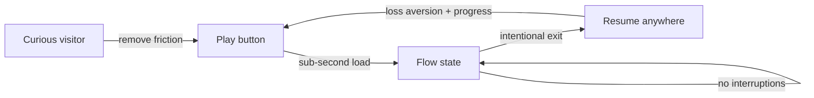

# ReadMaxxing — UI/UX Principles & Rules

> Goal: make the tool so smooth, calm, and readable that any reader **wants** to read more, longer, and faster with it. Every interaction is engineered against user psychology — not decorated on top of it.
>
> This file is the canonical design law for the web app, Chrome extension, and mobile apps. When code and this file disagree, this file wins.

---

## 1. The Core Philosophy: "The Content Is the Hero"

The app's job is to **disappear**. The moment a user is thinking about the interface instead of the text or the voice, we have failed. Three operating principles flow from this:

1. **Calm over clever.** A calm player gets more plays than a flashy one. We optimize for low cognitive load, not for impressing.
2. **Reduce friction to the play button.** Everything before "play" is a tax. Minimize it ruthlessly.
3. **Protect the flow state.** Once a user is reading/listening, interruptions are the costliest thing we can add. No autoplay-with-sound, no mid-flow recommendations, no decision demands.

---

## 2. Psychological Foundations (the "why")

These are the behavioral laws we design against. Every rule below traces back to one of these.

| Principle | What it means for us |
|---|---|
| **Flow** (Csikszentmihalyi) | Effortless engagement where the user loses track of time. Any interruption (slow load, confusing nav, mid-play prompt) breaks it. |
| **Cognitive Load / Miller's Law** | Working memory holds ~4 chunks. Show ≤7 items per view; chunk settings; progressive disclosure. |
| **Fitts's Law** | Time to hit a target scales with distance/size. Big primary controls, thumb-reachable on mobile, keyboard shortcuts to remove pointer travel. |
| **Hick's Law** | More choices = slower decisions. Reduce visible options at each moment to the essential. |
| **Loss Aversion** | People work harder to avoid losing something than to gain it. → Streaks, "your streak is at risk" (gentle, not anxious). |
| **Endowed Progress Effect** | Visible partial progress makes people more likely to continue. → Pre-filled progress, "X% read", streak calendars. |
| **Zeigarnik Effect** | Unfinished tasks stick in memory. → "Pick up where you left off" recaps create a gentle pull back. |
| **Identity Reinforcement** | "I'm a 2-Week Warrior" beats "I sometimes read." → Milestone names that build reader identity. |
| **Variable Reward** (Skinner) | Unpredictable rewards sustain engagement. → Surprise badges, "you just crossed 10k words", not a fixed drip. |
| **Habit Loop** (cue → routine → reward) | Design a daily cue (reminder), a frictionless routine (one tap to resume), and a reward (streak/progress). |
| **Decision Fatigue** | Evaluating options mid-flow costs retention. No "Suggested Next" cards during playback. |
| **Choice Paradox** | Too much customization = paralysis. Offer *theme presets* (Compact / Open / Relaxed) instead of raw sliders, with an "Advanced" escape hatch. |

---

## 3. Visual Language

### 3.1 Color & Contrast
- **Light mode:** warm off-white paper (`#FBFBF8`-ish), not pure white — pure white causes glare on long sessions.
- **Dark mode:** true-dark `#0E0E10` background, not `#000` (avoid OLED smear perception), with low-glare text at ~`#E6E6E0`.
- **Sepia / E-ink modes** for long-form and evening reading.
- **Contrast:** meet **WCAG 2.2 AA** (4.5:1 body, 3:1 large text). Aim higher (7:1 AAA) for the reading surface itself because it is the product.
- **Accent color:** a single, calm accent used only for the *active* state (current word highlight, play button, primary CTA). Never decorate with it.
- **Highlight (karaoke):** current sentence gets a soft tint background; current word gets a stronger accent underline/fill. Two-level emphasis so the eye locks without the page flashing.
- No more than **3 functional colors** on screen at once: text, surface, accent.

### 3.2 Typography (the single most important lever — type *is* the product)
- **Body size:** minimum **16px**, preferred **17–18px** for long-form prose. Fluid: `clamp(16px, 1.1vw + 1rem, 20px)`.
- **Line length (measure):** **50–75 characters per line**, target **66ch**. `max-width: 66ch` default for the reading column.
- **Line height:** body **1.5–1.6**; subheads **1.3**; large headings **1.1–1.2** (leading tightens as size grows).
- **Alignment:** left-aligned, ragged-right. Never justified (rivers of whitespace hurt comprehension).
- **Paragraph spacing:** at least **2× font size** (WCAG 1.4.12 floor). Use it as breathing room, not a divider line.
- **Letter/word spacing:** respect WCAG 1.4.12 floors (letter-spacing ≥ 0.12em, word-spacing ≥ 0.16em when user overrides). Defaults: leave body alone; tighten large headings slightly; never tighten small text.
- **Typeface families (swappable, user-controlled):**
  - Default serif for long-form (e.g. Source Serif / Charter) — perceived as "book-like", aids immersion.
  - Default sans for UI (Inter / system).
  - **Dyslexia-friendly option:** Atkinson Hyperlegible (evidence-backed) over OpenDyslexic (weak evidence). Offer, don't force.
  - **Mono option** for code/markdown blocks.
- **Hierarchy via size + weight**, not color. Size ratios from a modular scale (e.g. 1.250).
- **Numbers:** tabular figures for progress/time/durations so scrubbers don't jitter.
- **Dynamic Type:** always respect the OS/system font-scaling setting on web and mobile.

### 3.3 Layout & Space
- **Generous negative space** around text blocks — whitespace is a readability aid, not wasted space.
- **Reading-first layout:** the reading column is vertically centered and never competes with chrome. Side rails collapse on small screens.
- **Touch targets ≥ 44×44px** (WCAG 2.5.5). Primary play button larger (≥56px) and high-contrast.
- **Safe zones** on mobile for thumbs; primary controls in the lower thumb arc.
- **Grid:** consistent 4/8px spacing scale; no orphan 5px/13px values.

### 3.4 Motion & Micro-interactions
- Motion **communicates state**, never decorates. Banned: bounce on load, parallax on scroll, autoplay carousels.
- Transitions: **150–250ms**, `ease-out` for entrances, `ease-in` for exits. Respect `prefers-reduced-motion` (disable non-essential motion entirely).
- Highlight transitions: **120ms** word advance — fast enough to feel synced, slow enough to not strobe. No flashing > 3Hz (WCAG 2.3.1).
- Playback start: progress bar fills smoothly; never a hard jump. Buffering shows a subtle shimmer, not a spinner-of-doom.

---

## 4. The Player (the heart of the app)

This is where reading speed is won or lost. Rules, in priority order:

1. **Load in under 1 second.** Perceived performance is the first UX. A heavy, slow player fails before anyone sees a control. Stream audio (MPEG-TS/chunked) + start playback before full synthesis completes.
2. **Primary controls only, always visible:** Play/Pause (big), progress scrubber, time. Everything else (speed, voice, chapters, sleep timer, skip-fillers) tucked behind a small menu — *progressive disclosure*.
3. **Resume exactly where you left off.** 12 min into a 40 min track → return to 12 min, not 0. This single touch lifts completion rates materially. Persist position per user per doc, synced cross-device via Postgres Realtime + IndexedDB.
4. **Never autoplay with sound.** It creates negative friction and startles. Autoplay-permission must be explicit. After an episode ends, **pause** and show a minimal status line (`Paused • 42:17 / 58:03`) — enforce *intentional resumption*, reduce attention residue.
5. **Smooth, draggable scrubber** with visible duration so listeners know what they're committing to. Jumpy/laggy scrubbing makes the whole app feel cheap.
6. **Speed control 0.5×–4.5×**, preserving pitch. Default **1×**; remember per-user and per-doc. Speed presets (1×, 1.25×, 1.5×, 2×, 3×) as quick taps; custom via long-press.
7. **Keyboard-first** (Fitts's Law): `Space` play/pause, `←/→` ±15s, `Shift+←/→` ±30s, `↑/↓` speed, `J/K` prev/next sentence, `R` repeat sentence, `F` focus mode, `/` search. Show shortcuts in a discoverable `?` sheet.
8. **Sentence + word karaoke** synced to speech marks. Click any word to jump audio there. This is the core "read-along" value — it must feel telepathic, not laggy.
9. **Skip controls:** skip filler content, skip to next sentence/paragraph/chapter, repeat sentence. Low-prominence but always one key away.
10. **Background + lock-screen + media-keys** integration (web Media Session API; native on mobile). Listening continues when the tab is hidden.
11. **No recommendations during playback.** Avoid the decision-fatigue cost of evaluating "Suggested Next" mid-flow. Show next-up *only after* the content ends, as an intentional choice.
12. **Offline-first:** downloaded audio + segment tree play from IndexedDB with zero network. Hand off seamlessly when connectivity returns.

---

## 5. The Reader Surface (reading while listening)

- **Bionic Reading option (opt-in):** bold the initial fixation letters of each word to create saccade anchors. Evidence is mixed, but a meaningful dyslexia/ADHD subset self-reports strong benefit — offer it as a toggle, never default. Expose fixation % and opacity controls.
- **Auto-scroll** that keeps the current sentence in a comfortable eye zone (upper-third, not dead-center) — centering feels mechanical. Scroll eases, never jumps.
- **Focus mode:** dims/fades non-current paragraphs to lower distraction (ADHD-friendly). Toggle with `F`.
- **One-tap theme switch** (Light / Dark / Sepia / E-ink) with auto-follow system + time-of-day.
- **Reading ruler / line guide** option for low-vision and tracking difficulty.
- **Click-to-jump:** tap any word → audio seeks there and highlighting re-syncs. Bidirectional text↔audio binding is the magic trick.
- **Selection actions:** select text → menu offers "Listen from here", "Summarize this", "Ask about this", "Copy". Reduces mode-switching.
- **Progress affordance:** thin reading-progress rail + "X% • Y min left" — endowed progress keeps people going.

---

## 6. Library & Onboarding

### First-run (Activation is where most apps die)
- **Zero-friction start:** paste text or drop a file → playing within ~5 seconds, **before** asking for an account. Auth only when saving/syncing is needed (progressive disclosure of commitment).
- **One sample doc pre-loaded** so the experience is never empty (endowed progress).
- **Voice picker that plays instantly** — pick a voice by hearing it read *your* text, not a generic sample.
- **Default to a marquee/celebrity voice on first run** for instant "wow" impact (e.g. a recognizable narrator icon as the default tile). Choice paralysis is mitigated by: (a) a single bold default, (b) a one-tap "more voices" that previews each on *your* text, (c) the picker returning later in Settings, not blocking first play. The wow moment of hearing a famous voice read your own doc is a stronger activation hook than a neutral narrator.
- **Guided first 60 seconds:** a 3-step non-blocking coachmark (play, speed, highlight) then it vanishes forever. Skippable.

### Library
- **Calm grid/list**, ≤7 items per view chunk with "Load more" (Miller's Law) — not infinite scroll, which causes scanning fatigue.
- **"Continue listening" shelf at top** — the single most-used surface. Shows cover, title, progress bar, time left. One tap resumes at the exact word.
- **Recap card** on each in-progress doc: "Last time: …" (Zeigarnik pull). Generated by AI, 1–2 sentences, dismissible.
- **Filters, not folders:** by source type, tag, collection, recency, progress. Search is global and instant (`Cmd/Ctrl+K`).
- **Empty state is aspirational, not blank:** "Add your first book, article, or PDF" with drag-drop target and a sample.
- **Bulk actions** for power users; never block the common path.

---

## 7. AI Features (summary, quiz, recap, ask, podcasts, assistant, dictation)

Psychology: AI features are ** servants, not stars**. They reduce effort and increase competence (intrinsic motivation), which sustains habits better than badges alone.

- **Always cite the source segment.** Every AI answer links back to the exact sentence/offset so trust is verifiable. Trust > fluency.
- **Summaries are layered:** 1-line TL;DR → bullets → detailed. Progressive disclosure; never a wall of text.
- **Quiz = retrieval practice** (the strongest learning lever). Short, low-stakes, immediate feedback, no punishment for wrong answers. Frame as "test yourself", celebrate streaks of correct recall.
- **Recap on return** is short and specific ("You stopped at the section on X"). It lowers the cost of re-entry — the biggest barrier to resuming.
- **Ask-the-doc** is conversational but grounded; never hallucinates beyond the doc. Offer "explain like I'm 5" / "give me an example" quick chips to reduce prompt-writing effort.
- **Podcast generation** shows progress with honest stages (Reading doc → Writing script → Casting voices → Producing audio). Variable-reward payoff at the end; do not fake-estimate "2 seconds" when it takes 90.
- **Voice assistant** answers in the user's chosen TTS voice; keeps context of what they're listening to; supports voice-in (hands-free) so it works while walking/cooking.
- **Dictation** cleans grammar/fillers *and shows what changed* subtly (diff view) so the user trusts it; never silently rewrites meaning.
- **Latency honesty:** if something takes >2s, show a calm status with an estimated time, not an indeterminate spinner. Predictability reduces perceived wait.

---

## 8. Habit & Motivation Layer (Duolingo-style, high intensity)

We lean into aggressive habit-building — the kind that made Duolingo's streak culture a retention engine. The guardrail: **pressure and play, never shame**. We push hard on loss aversion and identity, but the user always has an escape hatch and is never made to feel guilty for life getting in the way.

- **Streaks (loss aversion, front-and-center):** a prominent daily reading streak with a fire/flame motif. Gentle but insistent "your streak is at risk" reminder in the afternoon if you haven't read. **Streak freeze** (earnable, 1/week base + bonus from milestones) and **24h streak recovery** so a missed day is recoverable, not catastrophic. Streak calendar is the endowed-progress anchor.
- **Push & in-app reminders** (user-configurable, on by default): morning cue ("Ready to keep your streak?"), at-risk-afternoon nudge, and a celebration ping when you hit the day's goal. Reminders are framed as invites, not demands.
- **Leaderboards (opt-out, on by default):** weekly leagues (Bronze → Diamond style) grouped by similar activity. Social comparison drives effort for most users; users who find it stressful can opt out into a private mode in one tap. Include friend leagues for the social-positive version.
- **Milestone badges with identity names:** "2-Week Warrior", "Century Reader", "Marathon Listener (10h)", "Speed Demon (50h at 2×+)". Names > numbers for identity. Bronze/Silver/Gold tiers.
- **XP & daily goal** (user-set: minutes, words, or articles). A visible ring fills as you read; completing the daily goal awards XP and protects the streak. Variable bonus XP for quizzes taken, podcasts finished, etc.
- **Variable rewards:** occasional surprise pop ("You just crossed 100k words this month — top 5% of readers"), not on a fixed schedule. Rare/secret badges for unexpected behaviors to sustain the Skinner-box pull.
- **Quests/challenges:** weekly mini-quests ("Listen to 3 docs", "Finish a podcast", "Take 2 quizzes") for bonus XP — creates short-term goals inside the long-term streak.
- **Weekly digest, push-delivered:** "You read 4h 12m this week, up 18% — you're #3 in your league." Reflective + social.
- **Streak share + milestone share** to turn engagement into organic growth (viral loop), but sharing is one optional button, never forced.
- **Pressure without shame:** if a streak breaks, the messaging is "Streak frozen — pick it back up today 💪" not "You failed." Never red/anxious error styling on streaks; always recoverable framing.
- **Progress is always real, never inflated.** Endowed progress (start at 1, not 0) is OK; fake progress destroys trust.

---

## 9. Accessibility (WCAG 2.2 AA minimum, AAA aspirational on the reading surface)

- Keyboard navigable everywhere; visible focus rings (never `outline: none` without replacement).
- Screen-reader labels on all controls; live regions announce current sentence for BR users.
- Respect `prefers-reduced-motion`, `prefers-color-scheme`, `prefers-contrast`, `prefers-reduced-transparency`.
- Text spacing must survive user stylesheet overrides (WCAG 1.4.12 — no clipping/overlap at the floor values).
- Dyslexia-friendly font + adjustable spacing + bionic reading + line guide + ruler.
- Captions/transcript always available alongside audio (deaf/hard-of-hearing + situational).
- Never rely on color alone to convey state.
- Adjustable speed *and* adjustable highlight emphasis (some users find strong highlight distracting).
- Audio ducking and clear error sounds optional; never startle.

---

## 10. Performance Budgets (perceived UX = performance)

- **LCP < 1.0s** on the reader page over fast 4G.
- **Time-to-play < 1s** for any doc already in the library.
- **INP < 100ms**; word-highlight advance jitter < 16ms (one frame).
- **Bundle:** route-split; the reader page ships ≤ 150KB JS (gzip) on first load. Heavy parsing (PDF/OCR) runs in a web worker or the Python service, never the main thread.
- **No layout shift** while streaming audio or loading marks (CLS < 0.05).
- Offline: full playback + highlighting from cache with zero network calls.

---

## 11. Interaction Rules (the small laws that add up)

- **One primary action per screen.** Secondary actions live in menus.
- **Defaults are opinions.** Ship opinionated defaults that work for 80%; expose power for the 20%.
- **Undo over confirm.** Prefer reversible actions to nagging modals. Destructive actions get a calm, clear confirm — nothing else does.
- **Feedback within 100ms** for any tap; optimistic UI for sync actions.
- **Errors are human and actionable:** "Couldn't reach the voice service — retry" not `Error 503`.
- **No dead ends.** Every empty/error/loading state offers a next step.
- **Consistency across surfaces:** playback controls, voice picker, and shortcuts are identical on web, extension, and mobile (internal + external consistency — Nielsen).
- **No mid-flow modals.** Save prompts, upsells, and surveys wait for natural pauses (end of doc, app open).
- **Sound is opt-in.** UI sounds off by default; the only audio the app makes by default is the content itself.

---

## 12. Copy & Tone

- Warm, calm, second-person, never hype. "Pick up where you left off." not "SUPERCHARGE your reading!!!"
- Numbers are honest: "4.2× faster" only when true for that doc/voice.
- Microcopy teaches capability in one line: "Hold to scrub • Space to play".
- Onboarding copy assumes the user is smart but busy; never condescending.

---

## 13. Measurement (how we know it's working)

We instrument against behavior, not vanity:
- **Activation:** % who reach first play within 60s of first open.
- **Aha:** % who adjust speed *and* use highlight in session 1.
- **Habit:** D1/D7/D30 retention; sessions/week; avg listening minutes/week.
- **Flow health:** session uninterrupted-rate (% of sessions with zero mid-play prompts), resume-rate after pause.
- **Comprehension:** quiz opt-in rate + accuracy trend (proxy for value delivered).
- **Friction signals:** scrub-retry rate, player-abandon events, settings-open-without-change (choice paralysis).
- Run qualitative reading-speed + comprehension tests under different typography/theme conditions; let data move defaults, never taste.

---

## 14. The Non-Negotiables

1. The content is the hero. The UI recedes.
2. Time-to-play < 1s. Always.
3. Resume to the exact word, on any device.
4. Never break the flow state once entered.
5. WCAG 2.2 AA everywhere; AAA on the reading surface.
6. Gamification pushes hard on streaks/identity/leagues — but never shames. Every loss is recoverable.
7. Honesty over persuasion — in numbers, in progress, in AI answers, in loading estimates.

---

### Sources consulted
- UXPin — Optimal Line Length for Readability (2026): 50–75 CPL, 66ch sweet spot, line-height 1.5+.
- Disability World — Inclusive Typography & WCAG 2.2 SC 1.4.12 floors (line-height 1.5, paragraph 2×, letter 0.12em, word 0.16em; ≥16px body).
- font.news — Typography in Reading Apps (16–20px body, 45–75 CPL, 1.3–1.8 line-height, dyslexia fonts, system scaling).
- Poper / think.design / diva-portal — Audio player UX: friction-to-play, progressive disclosure, resume, keyboard-first, no autoplay-sound, cross-device consistency.
- Flapcast — Miller's Law chunking (≤7), no mid-play recommendations, intentional resumption, keyboard nav (Fitts's Law).
- StriveCloud / Readima / Nature (MyReadscape) / FGFactory — Gamification: streaks + loss aversion, identity badges, self-monitoring dashboards, variable rewards, leaderboards (opt-out default per user decision), intrinsic > extrinsic.
- Duolingo streak-culture pattern — prominent flame streak, at-risk reminders, streak freeze/recovery, weekly leagues, XP + daily goals, shareable milestones, pressure-without-shame framing.
- Bionic Reading / UX Collective — opt-in fixation highlighting; mixed evidence, strong anecdotal ADHD/dyslexia benefit; offer, don't default.
